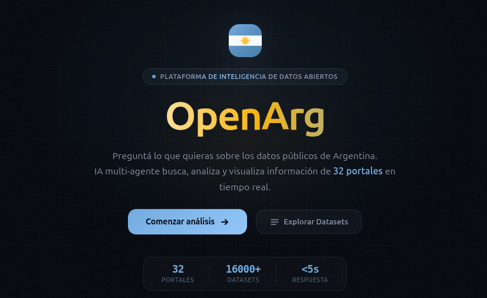
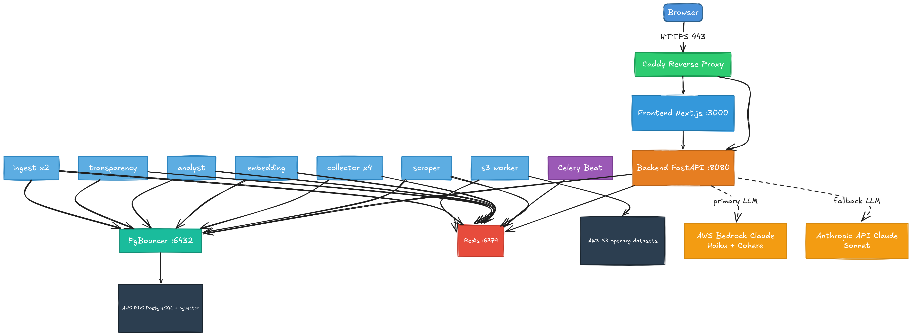
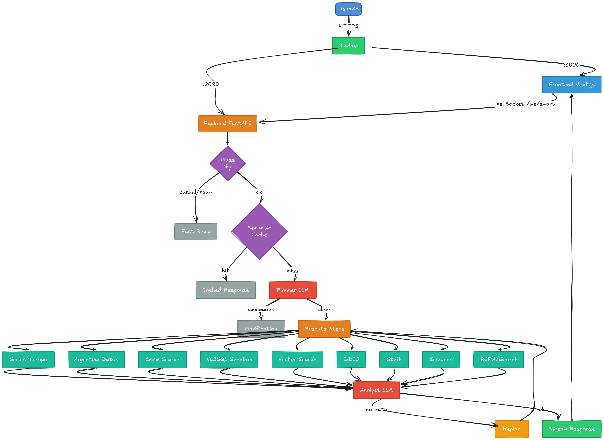
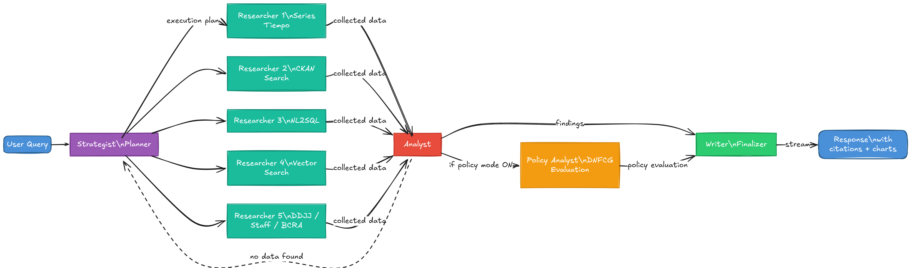
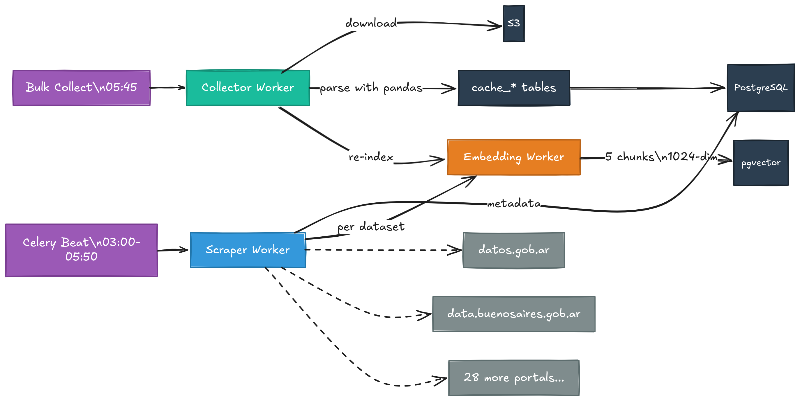

<h1 align="center">OpenArg Backend</h1>

<p align="center">
  <b>AI-powered analysis engine for Argentine open government data</b><br/>
  Query pipeline, data connectors, and LLM orchestration for openarg.org
</p>

<p align="center">
  
</p>

<p align="center">
  
  
  
  
  
</p>

---

## Overview

OpenArg Backend is the analysis engine behind [openarg.org](https://openarg.org) -- a platform that answers natural-language questions about Argentine public data. It orchestrates a multi-step query pipeline that classifies user intent, searches across 9 data connectors, generates SQL against cached datasets, and produces structured analyses with citations and chart data. Built with FastAPI, PostgreSQL + pgvector, Redis, Celery, LangGraph, and AWS Bedrock Claude (with Anthropic API fallback).

---

## Architecture

<p align="center">
  
</p>

Hexagonal (Ports & Adapters) architecture with four layers:

| Layer | Responsibility | Key Components |
|-------|---------------|----------------|
| **Presentation** | HTTP + WebSocket endpoints, auth middleware | FastAPI controllers, SlowAPI rate limiting |
| **Application** | Query orchestration, pipeline coordination | SmartQueryService, connectors |
| **Domain** | Pure entities, ports (interfaces), value objects | Dataclass entities, ABC port definitions |
| **Infrastructure** | External system adapters, persistence | PostgreSQL/pgvector, Redis, Celery, AWS Bedrock, LangGraph |

Domain ports define abstract interfaces (`IDataSource`, `ILLMProvider`, `IVectorSearch`, `ISQLSandbox`, `ICacheService`). Infrastructure adapters implement them. All wiring is handled by Dishka (IoC container).

---

## Query Pipeline

<p align="center">
  
</p>

The query pipeline is implemented as a **LangGraph** state machine. Four specialized AI agents collaborate on every query:

| Agent | Role | What it does |
|-------|------|-------------|
| **Strategist** (Planner) | Decomposes the question | Analyzes the query, selects data sources, generates a structured execution plan |
| **Researchers** (Collectors) | Gather data in parallel | Dispatch to 9 connectors concurrently — Series de Tiempo, CKAN, NL2SQL, vector search, DDJJ, Staff, BCRA, Georef, Argentina Datos |
| **Analyst** | Synthesizes findings | Analyzes collected data, generates insights with citations, chart data, and confidence scoring |
| **Policy Analyst** | Evaluates public policy | Optional agent (user-activated). Evaluates government policies using DNFCG criteria: pertinence, efficacy, efficiency, impact, and sustainability. Evidence-based, cites data |
| **Writer** (Finalizer) | Assembles the response | Formats markdown, extracts charts, builds source attribution, streams to the frontend |

<p align="center">
  
</p>

Pipeline nodes in execution order:

1. **Classification** -- Categorize as casual, meta, injection, or off-topic (0 LLM calls)
2. **Semantic cache** -- Check Redis + pgvector for a similar recent answer
3. **Preprocessing** -- Expand acronyms, resolve temporal references, normalize province names
4. **Planning** -- Strategist generates a structured execution plan (1 LLM call)
5. **Data collection** -- Researchers dispatch to 9 connectors in parallel
6. **NL2SQL** -- Generate and execute read-only SQL against cached tables (with 3-layer validation)
7. **Analysis** -- Analyst synthesizes findings (1 LLM call)
8. **Replanning** -- If data is insufficient, re-plan with a different strategy
9. **Response assembly** -- Writer formats the final response with citations, charts, and sources

---

## Data Sources

| Connector | Data | Source |
|-----------|------|--------|
| **Series Tiempo** | 30,000+ economic time-series (INDEC, BCRA) | apis.datos.gob.ar/series |
| **Argentina Datos** | Dollar rates (7 types), country risk | argentinadatos.com |
| **BCRA** | Central bank indicators, reserves, monetary base | bcra.gob.ar |
| **Sesiones** | Legislative session transcripts (vector search) | Congressional records |
| **DDJJ** | Patrimonial declarations (195 deputies) | Oficina Anticorrupcion |
| **Staff** | Congressional employee data (HCDN + Senado) | datos.hcdn.gob.ar |
| **Georef** | Geographic entities (provinces, departments, localities) | apis.datos.gob.ar/georef |
| **CKAN** | 3,000+ datasets across 20 government portals | Multiple CKAN portals |
| **SQL Sandbox** | Read-only queries against cached dataset tables | Internal PostgreSQL |

---

## Data Ingestion

<p align="center">
  
</p>

Celery workers handle the full ingestion lifecycle: catalog scraping, dataset downloading and parsing, vector embedding generation, and periodic refresh via Beat scheduler. Each stage runs on a dedicated queue with tuned concurrency.

---

## Workers

| Worker | Queue | Concurrency | Purpose |
|--------|-------|-------------|---------|
| **Scraper** | `scraper` | 2 | Scrape CKAN portal catalogs |
| **Collector** | `collector` | 4 | Download datasets, parse with pandas, cache in PostgreSQL |
| **Embedding** | `embedding` | 8 | Generate vector embeddings (3 chunks per dataset, 1024-dim via Bedrock Cohere) |
| **Analyst** | `analyst` | 2 | Execute query analysis pipeline |
| **Transparency** | `transparency` | 2 | Process transparency/budget data (presupuesto, DDJJ) |
| **Ingest** | `ingest` | 2 | Ingest structured data sources (senado, staff, series tiempo) |
| **S3** | `s3` | 2 | Handle S3 storage operations for large datasets |
| **Beat** | -- | 1 | Celery Beat scheduler for periodic tasks |

---

## Tech Stack

| Component | Technology |
|-----------|-----------|
| Framework | FastAPI 0.115 + Uvicorn (async, UVLoop) |
| Database | PostgreSQL 16 + pgvector (HNSW indexing, 1024-dim) |
| ORM | SQLAlchemy 2.0 (async) + Alembic migrations |
| Cache / Broker | Redis 7 |
| Task Queue | Celery 5.4 (7 workers + beat scheduler) |
| AI Models | AWS Bedrock Claude (primary) + Anthropic API Claude Sonnet (fallback) |
| Embeddings | AWS Bedrock Cohere Embed Multilingual v3 (1024-dim) |
| Pipeline | LangGraph (stateful graph with checkpointing) |
| DI Container | Dishka 1.6 |
| Auth | PyJWT + bcrypt + SlowAPI rate limiting |
| Monitoring | structlog + in-memory metrics + health checks |
| Config | TOML files + Pydantic settings |
| Deploy | Docker Compose on EC2, Caddy reverse proxy |

---

## Quick Start

### Docker (recommended)

```bash
git clone https://github.com/colossus-lab/openarg_backend.git
cd openarg_backend
cp .env.example .env
# Edit .env with your API keys (AWS credentials, DATABASE_URL, etc.)

docker compose up -d
```

### Local development

```bash
make install        # Install dependencies (requires uv)
make db.up          # Start PostgreSQL + Redis containers
make db.migrate     # Run Alembic migrations
make dev            # Start API with hot reload on port 8080
```

---

## API Endpoints

| Category | Method | Path | Purpose |
|----------|--------|------|---------|
| Health | GET | `/health` | Component-level health check |
| Health | GET | `/health/ready` | Readiness probe |
| Query | POST | `/api/v1/query/smart` | LangGraph pipeline (plan + collect + analyze) |
| Query | WS | `/api/v1/query/ws/smart` | LangGraph pipeline with WebSocket streaming |
| Query | POST | `/api/v1/query/quick` | Synchronous single-step query |
| Query | POST | `/api/v1/query/` | Submit async query |
| Query | GET | `/api/v1/query/{query_id}` | Check query status |
| Datasets | GET | `/api/v1/datasets/` | List indexed datasets |
| Datasets | GET | `/api/v1/datasets/stats` | Dataset counts per portal |
| Datasets | GET | `/api/v1/datasets/{id}/download` | Download original dataset file (presigned S3 URL) |
| Sandbox | POST | `/api/v1/sandbox/query` | Execute read-only SQL |
| Sandbox | POST | `/api/v1/sandbox/ask` | Natural language to SQL |
| Sandbox | GET | `/api/v1/sandbox/tables` | List cached tables |
| Taxonomy | GET | `/api/v1/taxonomy/*` | Taxonomy and category management |
| Transparency | GET/POST | `/api/v1/transparency/*` | Transparency and budget data |
| Admin | GET/POST | `/api/v1/admin/*` | Admin task management |
| Monitoring | GET | `/api/v1/metrics` | Request, connector, cache, and token metrics |

---

## Development

```bash
make install                   # Install dependencies (uv pip)
make dev                       # Start API with hot reload
make db.up                     # Start PostgreSQL + Redis containers
make db.migrate                # Run Alembic migrations
make db.revision msg="add xyz" # Create new migration

make workers.scraper           # Start scraper worker
make workers.collector         # Start collector worker
make workers.embedding         # Start embedding worker
make workers.analyst           # Start analyst worker
make workers.transparency      # Start transparency worker
make workers.ingest            # Start ingest worker
make workers.s3                # Start S3 worker
make beat                      # Start Celery Beat scheduler
make flower                    # Start Flower monitoring UI

make code.format               # Format with Ruff
make code.lint                 # Ruff check + mypy
make code.test                 # Pytest with coverage
make code.check                # Lint + tests
```

---

## Testing

```bash
make code.test              # Run all tests with coverage
pytest tests/unit/ -v       # Unit tests only
pytest tests/integration/   # Integration tests (requires DB + Redis)
```

CI runs unit tests, integration tests, and type checking against PostgreSQL 16 + pgvector and Redis 7. See `.github/workflows/test.yml`.

---

## Spec-Driven Design

This repo is documented using a reverse-SDD approach (inspired by [GitHub Spec Kit](https://github.com/github/spec-kit)): every module has a `spec.md` (what the code does and why) and a `plan.md` (how it is implemented). Specs live under [`specs/`](specs/) and are the source of truth for architectural intent.

| Entry point | Description |
|----------|-------------|
| [`specs/README.md`](specs/README.md) | Index of all 13 module specs |
| [`specs/constitution.md`](specs/constitution.md) | Non-negotiable principles (hexagonal, DI, async-first, etc.) |
| [`specs/000-architecture/`](specs/000-architecture/) | Macro architecture, layers, auth inventory |
| [`specs/001-query-pipeline/`](specs/001-query-pipeline/) | 16-node LangGraph pipeline spec |
| [`specs/FIX_BACKLOG.md`](specs/FIX_BACKLOG.md) | Prioritized backlog of fixes discovered during spec review |
| [`specs/REVIEW_REPORT_2026-04-10.md`](specs/REVIEW_REPORT_2026-04-10.md) | Senior-engineer review report cross-checking specs against code |

## Documentation

| Document | Description |
|----------|-------------|
| [Architecture](docs/architecture.md) | System design and hexagonal architecture overview |
| [Diagrams (Mermaid)](docs/diagrams.md) | Architecture diagrams source (query pipeline, multi-agent, data ingestion, infrastructure) |
| [API Reference](docs/api-reference.md) | Full endpoint documentation with request/response schemas |
| [Database Schema](docs/database-schema.md) | Table definitions, indexes, and migration strategy |
| [Worker Pipeline](docs/worker-pipeline.md) | Celery workers, queues, and task routing |
| [Query Pipeline Map](docs/pipeline-map.md) | LangGraph nodes, edges, and state transitions |
| [Deployment](docs/deployment.md) | Docker Compose, EC2, and Caddy configuration |
| [Configuration](docs/configuration.md) | Environment variables, TOML config, and secrets |
| [Domain Layer](docs/domain-layer.md) | Entities, ports, and domain exceptions |
| [Infrastructure Layer](docs/infrastructure-layer.md) | Adapters, resilience patterns, and persistence |
| [Backup & Restore](docs/backup-restore.md) | Database backup procedures and disaster recovery |
| [Runbook](docs/runbook.md) | Operational playbooks for common incidents |

Frontend repository: [colossus-lab/openarg_frontend](https://github.com/colossus-lab/openarg_frontend)

---

## Contributing

We welcome contributions! Please read our guidelines before getting started:

- [**Contributing Guide**](CONTRIBUTING.md) — Setup, workflow, PR process, and coding standards
- [**Code of Conduct**](CODE_OF_CONDUCT.md) — Expected behavior and community standards
- [**Security Policy**](SECURITY.md) — How to report vulnerabilities responsibly

Quick steps:

1. Fork the repository
2. Create a feature branch (`git checkout -b feature/my-feature`)
3. Run `make code.check` before committing
4. Open a pull request against `staging` — the repo includes PR and issue templates to guide you

---

## License

[MIT](LICENSE)

---

<p align="center">
  <br/>
  Created by <b>Luciano Carreno</b> & <b>Dante De Agostino</b><br/>
  Powered by <a href="https://colossuslab.org"><b>ColossusLab</b></a>
</p>
