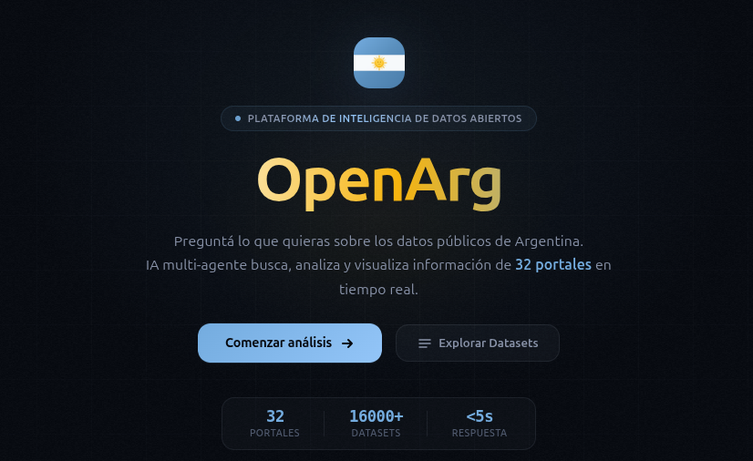
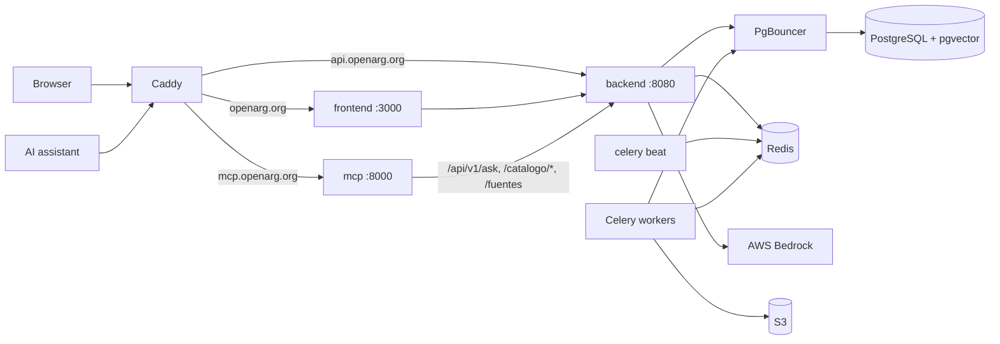
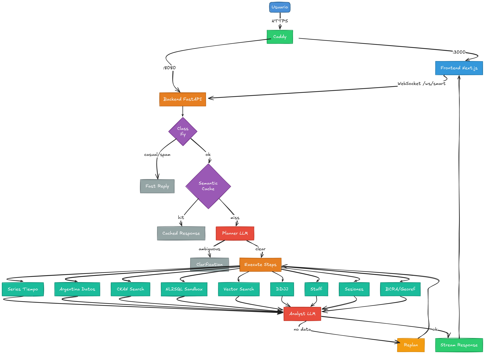

<h1 align="center">OpenArg Backend</h1>

<p align="center">
  <b>AI-powered analysis engine for Argentine open government data</b><br/>
  Answer engines, data catalogue, connectors and ingestion workers behind openarg.org
</p>

<p align="center">
  
</p>

<p align="center">
  
  
  
  
  
</p>

---

## Overview

OpenArg Backend answers natural-language questions about Argentine public data, with sources. The same answer engine serves three channels:

| Channel | Entry point | Who uses it |
|---------|-------------|-------------|
| Web chat | `WS /api/v1/query/ws/smart` and `POST /api/v1/query/smart` | The [frontend](https://github.com/colossus-lab/openarg_frontend) at [openarg.org](https://openarg.org) |
| Public API | `POST /api/v1/ask` at `api.openarg.org` | Developers with a personal key (`oarg_sk_…`) |
| Public MCP | [`mcp_publico/`](mcp_publico/README.md), served at `mcp.openarg.org` | AI assistants (Claude, Cursor, VS Code…), with the same personal key |

Behind them: a catalogue of the datasets of the Argentine open-data portals (downloaded into PostgreSQL, embedded with Cohere through AWS Bedrock and searched with pgvector), curated SQL marts, live connectors to official APIs (Series de Tiempo, BCRA, Georef…), and Celery workers that keep all of it fresh on a schedule.

Built with FastAPI, PostgreSQL 16 + pgvector, Redis 7, Celery, Dishka, LangGraph and Claude models on AWS Bedrock.

---

## Architecture


```mermaid
graph LR
  Browser --> Caddy
  Assistant[AI assistant] --> Caddy
  Caddy -->|openarg.org| Frontend[frontend :3000]
  Caddy -->|api.openarg.org| API[backend :8080]
  Caddy -->|mcp.openarg.org| MCP[mcp :8000]
  Frontend --> API
  MCP -->|"/api/v1/ask, /catalogo/*, /fuentes"| API
  API --> PgBouncer --> PG[(PostgreSQL + pgvector)]
  API --> Redis[(Redis)]
  API --> Bedrock[AWS Bedrock]
  Beat[celery beat] --> Redis
  Workers[Celery workers] --> Redis
  Workers --> PgBouncer
  Workers --> S3[(S3)]
```

Services and hostnames come from [`docker-compose.prod.yml`](docker-compose.prod.yml) and the [`Caddyfile`](Caddyfile). Caddy returns 404 for `/docs`, `/openapi.json`, `/api/v1/admin/*` and `/api/v1/data/*` on the public API domain; those are reached only from inside the Docker network.

Hexagonal (Ports & Adapters) architecture with four layers under `src/app/`:

| Layer | Responsibility | Where to look |
|-------|---------------|---------------|
| **Presentation** | HTTP + WebSocket endpoints, auth middleware, rate limits | `presentation/http/controllers/*`, `presentation/http/middleware/*` |
| **Application** | Answering, querying, catalogue, data quality, marts, ingestion logic | `application/` (modules below) |
| **Domain** | Entities and ports (abstract interfaces) | `domain/entities/*`, `domain/ports/*` |
| **Infrastructure** | Adapters (Bedrock, pgvector, Redis, sandbox, connectors), Celery, persistence | `infrastructure/` |

Ports include `ILLMProvider`, `IAgentLLM`, `IEmbeddingProvider`, `IVectorSearch`, `ISQLSandbox`, `ICacheService`, `IServingPort` and one interface per connector (`ISeriesTiempoConnector`, `IBCRAConnector`, …). All wiring lives in `setup/ioc/provider_registry.py` (Dishka).

### Application modules that matter

| Module | What it does |
|--------|--------------|
| `answers/` | The answer engines and everything around them: `engine.py` (the `AnswerEngine` contract and engine selection), `agent_engine.py` (tool-using agent), `legacy_engine.py` (the LangGraph graph behind the same contract), `runner.py` (`EngineRunner`: the turn deadline and a `query_analytics` row for a turn that did not finish, for every engine; for an engine that does not handle the rest itself, today the agent, also the greetings/injection filter, semantic cache, history, stale-data notice, `query_analytics` and audit, which the legacy graph does in its own nodes), `tools/` (the agent's tools), `verification.py` (figure checker), `prompt.py`. |
| `consultas/` | Query builders shared by the agent and the MCP data mode: number formats stored as text (`numeros`), date columns and period filters (`fechas`), the filter grammar (`filtros`), value suggestions when a filter matches nothing (`sugerencias`), aggregates (`agregar`). All values travel as bound parameters. |
| `catalog/` | Catalogue naming and integrity: physical table names, collapsing duplicate copies of the same file in search results (`collapse.py`), the nightly search recall canary (`search_canary.py`), registry reconciliation, schema snapshots. |
| `quality/` | Signals that reach a person: how old the data behind an answer is (`data_age.py`), mart expectations, source heartbeats, portal and model canaries, and Telegram alerts (`alerting.py`). |
| `marts/` | Curated materialized views declared in [`config/marts/*.yaml`](config/marts/README.md) (76 YAMLs): YAML loading, DDL builder, `live_table` macros over the `raw` layer, redirect of blocked marts. |
| `pipeline/` | The legacy LangGraph pipeline (nodes, NL2SQL subgraph, connectors dispatch) plus the parsers the collector uses (`pipeline/parsers/`). |
| `public_catalog.py`, `public_quota.py`, `web_quota.py`, `api_key_service.py`, `ask_dedupe.py` | Public API data mode, monthly quotas (API/MCP and web chat), key verification and billing, and de-duplication of repeated `/ask` questions. |

Other modules: `collection/`, `expander/` (Excel sheets and ZIP children), `validation/` (ingestion detectors), `repair/` (in-place fixes to already-ingested tables), `drift/`, `state_machine/`, `discovery/`, `skills/`.

---

## Answer engines

Every channel asks an `AnswerEngine` through `EngineRunner`, so the chat, `/smart` and `/ask` (and therefore the MCP) always answer with the same engine. There are two:

| Engine | `ANSWERS_ENGINE` | Model (default) | How it works |
|--------|------------------|-----------------|--------------|
| **Agent** | `agent` | Claude Sonnet 4.6 on Bedrock (`BEDROCK_AGENT_MODEL`, default `us.anthropic.claude-sonnet-4-6`) | One model in a tool loop: search, look at the table, then query. |
| **Legacy** | `legacy` (code default) | Claude Haiku 4.5 on Bedrock (`BEDROCK_LLM_MODEL`), Gemini as fallback (`GEMINI_API_KEY`, `GEMINI_MODEL`) | The LangGraph graph: classify → cache → plan → execute steps → analyse → finalize. |

How it is chosen (`answers/engine.py`, `smart_query_v2_router.py::_answer_engine`):

- `ANSWERS_ENGINE` is read on every turn. The code default is `legacy`; an unknown value logs an `ERROR` and falls back to `legacy`. Switching back is changing the variable, without a deploy.
- With `agent` but no agent model available, the router logs an error and answers with `legacy`.
- The agent has answered in production since 3 October 2026 (as noted in `consultas/sugerencias.py`); whichever engine a server runs is decided by its `.env`, not by the code.

### The agent

Each turn (`answers/agent_engine.py`): the model receives the question (with history and the previous turns' sources) and the tools; tool calls run in parallel, each one emitting a `status` event the chat shows; the final text streams as `chunk` events. Budget per turn: at most 10 tool calls, 35 s of tool time before the model is asked to answer with what it has, 25 s per tool call. The agent has no deep mode: `mode` only labels metrics (and a `deep` turn skips the semantic cache).

Tools (`answers/tools/`, built by `build_tools`; a tool whose dependency is missing is not offered):

| Tool | Source | Use |
|------|--------|-----|
| `buscar_series` | Series de Tiempo API (datos.gob.ar) | Find official time series (CPI, GDP, EMAE, unemployment, wages…) |
| `series_tiempo` | Series de Tiempo API | Values of one or more series, with period-over-period / year-over-year / year-to-date representations |
| `variables_bcra` | BCRA statistics API v4 | Reserves, official exchange rates (retail and A 3500 wholesale), rates, monetary base, UVA, CER… |
| `buscar_datos` | Catalogue (vector search) | Tables that may answer the question; prefers curated `mart.*` tables |
| `describir_tabla` | Sandbox | Columns, types, rows, period covered, sample rows, survey weights, geographic columns |
| `obtener_datos` | Sandbox (`consultas/`) | Read rows with period, filters and order (no SQL from the model) |
| `calcular` | Sandbox (`consultas/agregar`) | Sum, count, average, min/max with grouping, filters and survey weights |
| `cotizaciones` | DolarApi / ArgentinaDatos | Non-official dollar quotes (blue, MEP, CCL…) and country risk |
| `declaraciones_juradas` | Static dataset (195 deputies' asset declarations) | Search, rankings, aggregate statistics |
| `sesiones` | Chamber of Deputies session transcripts (vector search) | What was said about a topic, attributed to the speaker |
| `personal_legislativo` | HCDN payroll (database) | Staff per legislator, changes, totals |
| `ubicar_lugar` | Georef | Normalize a place name (never cited as a source) |
| `pedir_aclaracion` | — | Last resort: end the turn with a question and options |

### Figure verification (`ANSWERS_VERIFY_MODE`)

After the agent answers, every figure in the text is looked up in what the tools returned (`answers/verification.py`): format-normalized, sign-aware, counting only rows the model actually saw, and accepting derived figures it can reproduce (differences, shares, period variations, annual sums of a monthly series).

| Mode | Behaviour |
|------|-----------|
| `off` | No verification. All evidence is cited, without structured citations. |
| `shadow` (**default**) | Results go to the `answers.verify` log; the answer text and its citations are unchanged. If every figure is backed, the stale-data notice puts the evidence that contributed figures first and leaves out same-titled evidence that contributed none; if every figure is direct or derived, the source list is the selection (what was read and not used is not listed as a source, "option B"). |
| `correct` | Only the evidence used is cited, with structured citations; if some figures are unbacked the agent gets **one** corrective round (the streamed text is replaced via `clear_answer`), and figures still unbacked after it are named in a notice at the top. Figures are never deleted from the text. |

Except with `off`, causal phrases ("generó", "debido a"…) are logged to `answers.causal` (`answers/neutrality.py`); they never change the answer.

### Stale-data notice (agent engine)

For an engine that does not handle the cross-cutting work itself (`handles_cross_cutting = False`, today only the agent), `EngineRunner` puts at most two notices **at the top of the answer text** when the cited evidence's last observation is late for its frequency, or the source itself says the series is no longer updated (`quality/data_age.py`). Questions that name a closed period ("first half of 2026") do not trigger it. Because it is in the text, `/ask`, the MCP and the web chat all show it. For a catalogue table, which carries no date of its last observation, it adds to `warnings` when OpenArg last read it.

The legacy graph (`handles_cross_cutting = True`) does not get the notice in the text: the runner leaves the turn to the graph, and its `finalize` node only adds to `warnings` when the catalogue table it served was last read (`staleness_warning`).

### The legacy graph

<p align="center">
  
</p>

`application/pipeline/graph.py` wires 17 nodes: `classify`, `fast_reply`, `cache_check`, `cache_reply`, `load_memory`, `preprocess`, `skill_resolver`, `scoping`, `planner`, `clarify_reply`, `inject_fallbacks`, `execute_steps`, `analyst`, `coordinator`, `policy`, `replan`, `finalize`, plus the NL2SQL subgraph (`pipeline/subgraphs/nl2sql.py`). It dispatches to the connectors in `pipeline/connectors/`; its vector-search connector uses hybrid search (vector + BM25 with RRF fusion). With `mode="deep"` (or the old `policy_mode` flag) it runs `scoping`, may run `policy`, and its reasoning-heavy nodes use `BEDROCK_LLM_MODEL_DEEP` (defaults to `BEDROCK_LLM_MODEL`). Its LangGraph checkpointer is only used by this engine.

---

## Catalogue search

`PgVectorSearchAdapter.search_datasets_ann` (`infrastructure/adapters/search/pgvector_search_adapter.py`) is what the agent's `buscar_datos`, `GET /api/v1/catalogo/buscar` (the MCP) and `/api/v1/data/search` use:

1. A walk of the HNSW index fetching **400** candidate chunks (`hnsw.ef_search` 300, with pgvector's iterative scan when available).
2. If enough datasets come back but the best score is weak (< 0.55), a **wider walk of 1000** candidates (no portal filter only).
3. If there are still too few datasets or the top is still weak, the **exact search** over every chunk, capped at **1.5 s**; past the cap, the index hits are served.

Results are then collapsed so that copies of the same file show once (`catalog/collapse.py`). The `search-recall-canary` beat entry measures the index alone against the exact search every night on ~20 fixed queries and alerts if recall@10 drops below 0.95. The legacy graph's vector-search connector uses `search_datasets_hybrid` instead.

---

## Data sources

| Source | How it is reached | Used by |
|--------|-------------------|---------|
| Series de Tiempo (apis.datos.gob.ar) | Live API (`SeriesTiempoAdapter`); a daily ETL also copies curated series to `raw.cache_series_*` | Agent (live), legacy, MCP data mode (tables) |
| BCRA | Live API: monetary statistics v4.0 and exchange statistics v1.0; daily snapshot with history in `raw.cache_bcra_cotizaciones` | Agent, legacy, marts |
| DolarApi / ArgentinaDatos | Live API | Agent (`cotizaciones`), legacy |
| Georef (apis.datos.gob.ar/georef) | Live API | Agent, legacy |
| Asset declarations (Oficina Anticorrupción) | Static dataset `infrastructure/data/ddjj_dataset.json` (195 records) | Agent, legacy |
| Chamber of Deputies sessions | Transcript chunks, vector search | Agent, legacy |
| HCDN payroll | Database tables refreshed weekly | Agent, legacy |
| Open-data portals (CKAN, DKAN and others) | Scraped daily into `datasets`, downloaded into `raw.*` tables, embedded into `dataset_chunks` | Catalogue search, sandbox, MCP data mode |
| Curated marts | Materialized views in schema `mart` built from `config/marts/*.yaml` | Agent (preferred by `buscar_datos`), legacy |

---

## Workers and the beat schedule

Answers run in the API process; Celery handles ingestion and upkeep. Queues, routes and the schedule are in [`infrastructure/celery/app.py`](src/app/infrastructure/celery/app.py); the consumers and concurrency below are those of `docker-compose.prod.yml` and `docker/*.Dockerfile`.

| Service | Queues | Concurrency | Main tasks |
|---------|--------|-------------|------------|
| `worker-scraper` | `scraper` (also the default queue) | 2 | Portal catalogues, DKAN, Senate, Córdoba legislature, governors, staff snapshot |
| `worker-collector` | `collector` | `OPENARG_COLLECTOR_CONCURRENCY` (8) | Download, parse and store datasets in `raw.*` |
| `worker-collector-heavy` / `-heavy-retry` | `collector-heavy` / `collector-heavy-retry` (`OPENARG_HEAVY_COLLECT_QUEUE`, `OPENARG_HEAVY_RETRY_QUEUE`) | 1 each | Large files, routed by size and portal |
| `worker-ingest` | `ingest`, `orchestrator` | 4 | Structured sources (series, BCRA, presupuesto, INDEC, Georef, BAC), marts, sweeps, cleanups, canaries, alerts; `bulk_collect_all` and `refresh_stale_datasets` on `orchestrator` |
| `worker-embedding` | `embedding` | 8 | Dataset and session embeddings, catalogue enrichment |
| `worker-analyst` | `analyst` | 2 | Model-based repairs (`repair_columns_with_llm`, `repair_mart_sources`). `analyze_query` is still registered but nothing dispatches it. |
| `worker-transparency` | `transparency` | 2 | Portal health scores, session topics |
| `worker-s3` | `s3` | 2 | Uploads of original files to S3 |
| `beat` | — | 1 | The schedule below |

No worker consumes a `default` queue; `tests/unit/test_celery_queues_have_consumers.py` guards that every route has a consumer. Note that an entry's `options.queue` in `beat_schedule` overrides `task_routes`.

The beat timezone is `America/Argentina/Buenos_Aires`, so all times are ART. 94 entries; the main groups:

| When | What |
|------|------|
| Every 15–30 min | `recover-stuck-tasks`, `close-resolved-findings`, `cleanup-orphan-temp-files` (one per collector queue), `ops-portal-health`, `catalog-backfill-refresh`, ingestion and state-invariant sweeps |
| Hourly / every 6 h | `cleanup-invariants-hourly`, `backfill-dataset-columns`; `retain-raw-versions`, `cleanup-raw-orphans`, `refresh-stale-datasets`, `cleanup-semantic-cache`; `bulk-collect-datasets` at 01:45, 07:45, 13:45, 19:45 |
| 02:40 | `search-recall-canary` |
| 03:00–05:50 | `scrape-<portal>` for 29 portals, staggered; marts refresh (03:00) and audit (03:45); `snapshot-bcra` (04:00); registry reconciliation, repairs and schema baselines (04:10–05:30) |
| 06:00–07:10 | Transparency scoring, title and rejected-resource repairs, approved repairs, S3 retries, failed-task report, own-failure retries, stale-ingest alert |
| 08:30–08:50 | `retry-degraded-marts`, `portal-canary`, `check-mart-expectations` |
| 09:00 and 21:00 | `quality-alerts` (Telegram) |
| 18:45 / 19:30 | `ingest-series-tiempo` / `check-series-freshness` |
| Weekly | Sunday cleanups, BAC and Senate ingests, failed-collector reset; Monday staff snapshots, state map and schema-drift report; Tuesday empty-content scan; Saturday DKAN scrapes |
| Monthly | Georef, governors, Córdoba legislature (day 1), presupuesto (day 5), INDEC (day 15) |

**Stopping entries without a deploy.** `OPENARG_BEAT_DESACTIVADAS` takes a comma-separated list of **entry names** (the keys of `beat_schedule`, e.g. `ingest-series-tiempo,check-series-freshness,snapshot-bcra`), not task names. They are removed when the Celery app is created, so the variable goes in the `.env` shared by beat and workers and takes effect when they are recreated. An unknown name is logged as `ERROR` and stops nothing. Details in [`docs/deploy-produccion.md`](docs/deploy-produccion.md).

Two ETLs worth knowing: the series ETL loads into `<table>__nueva` and swaps with two `RENAME`s in one transaction, keeping the previous table as `raw.<table>__previa` (rolling back is another `RENAME`, see [`docs/runbook.md`](docs/runbook.md) §9); the BCRA snapshot accumulates one row per `(fecha, codigoMoneda)` and can backfill history (`snapshot_bcra(backfill_desde=...)`).

---

## Public API and public MCP

The public endpoints authenticate with the user's key: `Authorization: Bearer oarg_sk_…` (keys are created from the frontend through `/api/v1/developers/keys`). For that to work, a path has to be in `PUBLIC_API_PATHS` (`presentation/http/middleware/public_paths.py`), the one list both auth middlewares (`APIKeyMiddleware` and `GoogleJwtAuthMiddleware`) read, so that they let it through to the router's own key check. A path missing from it still works locally, where neither middleware is installed, but gets a 401 on staging and prod. `tests/unit/test_api_publica_pasa_los_middlewares.py` checks that the list is exactly the routes under `controllers/public_api/`.

| Endpoint | Mode | Counts against |
|----------|------|----------------|
| `POST /api/v1/ask` | Answers (runs the engine, pays Bedrock) | Monthly **questions** |
| `GET /api/v1/fuentes` | Data (no LLM) | Monthly **data requests** |
| `GET /api/v1/catalogo/buscar` | Data | Monthly data requests |
| `GET /api/v1/catalogo/tabla` | Data | Monthly data requests |
| `POST /api/v1/catalogo/datos` | Data | Monthly data requests |
| `POST /api/v1/catalogo/agregar` | Data | Monthly data requests |

Quotas (`application/public_quota.py`, `api_key_service.py`), counted per person and reset on the 1st at 00:00 UTC:

- Free: 10 questions and 200 data requests per month (`PUBLIC_API_MONTHLY_PREGUNTAS`, `PUBLIC_API_MONTHLY_DATOS`); Fundador: 100 and 2,000 (`PUBLIC_API_FOUNDER_*`); credits are spent only after the month is used up.
- `/ask` reserves the question on entry and charges it only for a complete answer that used the model; timeouts, errors, blocked injections, fixed replies, clarifications and cache hits give it back. The same question from the same key within 5 minutes returns the computed answer without charging.
- Daily caps: free-plan questions for everybody together (`PUBLIC_API_GLOBAL_DAILY_CAP`, 300), per client IP (`PUBLIC_API_IP_DAILY_LIMIT`, 30), and unbilled model runs per person (`PUBLIC_API_USER_UNBILLED_DAILY_LIMIT`, 20). Per minute: 2 questions on the free plan, 30 data requests.
- Turn timeout: `PUBLIC_API_TIMEOUT_SECONDS` (30 s).

The web chat has its own monthly quota (`application/web_quota.py`): 30 questions (`PUBLIC_WEB_MONTHLY_PREGUNTAS`), 100 for Fundadores, a daily cap for everybody (`PUBLIC_WEB_GLOBAL_DAILY_CAP`, 1000), counted only for complete answers; credits are shared with the MCP.

The **public MCP** (`mcp_publico/`, `docker/mcp.Dockerfile`) is stateless and has no database access: it forwards the user's key to the backend, which validates, charges and answers. Tools:

| MCP tool | Backend endpoint |
|----------|------------------|
| `consultar_datos_publicos` | `POST /api/v1/ask` |
| `listar_fuentes` | `GET /api/v1/fuentes` |
| `buscar_datasets` | `GET /api/v1/catalogo/buscar` |
| `describir_tabla` | `GET /api/v1/catalogo/tabla` |
| `obtener_datos` | `POST /api/v1/catalogo/datos` |
| `agregar_datos` | `POST /api/v1/catalogo/agregar` |

It also serves the site at `/` and `/health`. Its timeout to the backend (`MCP_BACKEND_TIMEOUT_SECONDS`, 75 s) must stay above `PUBLIC_API_TIMEOUT_SECONDS` + 10 s. See [`mcp_publico/README.md`](mcp_publico/README.md) and [`specs/029-mcp-publico/`](specs/029-mcp-publico/spec.md). The operations MCP in [`scripts/ops_mcp/`](scripts/ops_mcp/README.md) is a different, internal tool.

---

## API endpoints

"Service" below means what the frontend sends: the shared service key in `X-API-Key` (`BACKEND_API_KEY`) **and**, where `GOOGLE_OAUTH_CLIENT_ID` is set (mandatory in prod), the user's Google ID token in `Authorization: Bearer` (`APIKeyMiddleware`, `GoogleJwtAuthMiddleware`).

| Category | Method | Path | Auth |
|----------|--------|------|------|
| Health | GET | `/health`, `/health/ready` | Public (`/health` lists components only with `X-API-Key`) |
| Chat | POST | `/api/v1/query/smart` | Service |
| Chat | WS | `/api/v1/query/ws/smart` | `X-API-Key` in the handshake (the `?api_key=` query param still works but is deprecated); optional `id_token` in the first message |
| Public API | POST | `/api/v1/ask` | `Bearer oarg_sk_…` |
| Public API (data mode) | GET/POST | `/api/v1/fuentes`, `/api/v1/catalogo/{buscar,tabla,datos,agregar}` | `Bearer oarg_sk_…` |
| Developers | POST/GET/DELETE | `/api/v1/developers/keys`, `/api/v1/developers/usage` | Service |
| Conversations | GET/POST/PATCH/DELETE | `/api/v1/conversations/*` (incl. message feedback) | Service |
| Users | POST/GET/PATCH/DELETE | `/api/v1/users/sync`, `/api/v1/users/me*` | Service |
| Datasets | GET | `/api/v1/datasets/`, `/stats`, `/{id}/download` | Service |
| Sandbox | POST/GET | `/api/v1/sandbox/query`, `/tables`, `/ask` | Service |
| Taxonomy / skills | GET | `/api/v1/taxonomy`, `/api/v1/taxonomy/hints`, `/api/v1/skills` | Service |
| Transparency | GET/POST | `/api/v1/transparency/*` | Service; the POSTs (`rescore`, `rescrape`, `snapshot-staff`, `flush-cache`) take `X-Admin-Key` instead of the user token |
| Monitoring | GET | `/api/v1/metrics`, `/api/v1/metrics/prometheus` | Service |
| Admin | GET/POST/DELETE | `/api/v1/admin/*` (tasks, analytics, MCP analytics, data health, findings, repairs, supporters and credits) | `X-Admin-Key` (`ADMIN_API_KEY`) |
| Internal data API | GET/POST | `/api/v1/data/{query,tables,search}` | `Bearer` service token (`DATA_SERVICE_TOKEN`) |

The old `query_router` (`POST /api/v1/query/`, `/quick`, `/{id}`, `/cache`, `ws/stream`) was removed on 2026-05-05 (`root_router.py`). `/docs` and `/openapi.json` are served only outside `APP_ENV=prod`.

---

## Configuration

Settings are Pydantic models (`setup/config/settings.py`) loaded from `config/{APP_ENV}/config.toml` + `.secrets.toml`, with environment-variable overrides. Variables that matter, by the name the app reads (no values here; defaults are the code's; on the servers some of them are built by the compose, see below the table):

| Area | Variables |
|------|-----------|
| Core | `APP_ENV` (`local`/`dev`/`prod`/`test`), `DATABASE_URL`, `SANDBOX_DATABASE_URL` (read-only role for the sandbox), `CELERY_BROKER_URL`, `CELERY_RESULT_BACKEND`, `REDIS_CACHE_URL`, `LOG_LEVEL`, `SENTRY_DSN` |
| Answer engine | `ANSWERS_ENGINE` (`legacy` default / `agent`), `ANSWERS_VERIFY_MODE` (`off` / `shadow` default / `correct`) |
| Models | `AWS_REGION`, `BEDROCK_AGENT_MODEL` (Sonnet 4.6), `BEDROCK_LLM_MODEL` (Haiku 4.5), `BEDROCK_LLM_MODEL_DEEP`, `BEDROCK_EMBEDDING_MODEL` (Cohere Embed Multilingual v3, 1024 dimensions), `GEMINI_API_KEY`, `GEMINI_MODEL` |
| AWS credentials | None required in `.env`: boto3's default chain is used, so on the servers the EC2 instance role provides them. `AWS_ACCESS_KEY_ID` / `AWS_SECRET_ACCESS_KEY` still work locally. `S3_BUCKET` |
| Auth | `BACKEND_API_KEY` (chat/frontend service key, `X-API-Key`), `ADMIN_API_KEY` (`X-Admin-Key`; mandatory in prod and different from the backend key), `GOOGLE_OAUTH_CLIENT_ID` (mandatory in prod: the app refuses to start without it; on the servers it comes from `GOOGLE_CLIENT_ID`, see below), `DATA_SERVICE_TOKEN`, `CORS_ALLOWED_ORIGINS` |
| Public API / web quotas | `PUBLIC_API_MONTHLY_PREGUNTAS`, `PUBLIC_API_MONTHLY_DATOS`, `PUBLIC_API_FOUNDER_PREGUNTAS`, `PUBLIC_API_FOUNDER_DATOS`, `PUBLIC_API_GLOBAL_DAILY_CAP`, `PUBLIC_API_IP_DAILY_LIMIT`, `PUBLIC_API_USER_UNBILLED_DAILY_LIMIT`, `PUBLIC_API_TIMEOUT_SECONDS`, `PUBLIC_WEB_MONTHLY_PREGUNTAS`, `PUBLIC_WEB_FOUNDER_PREGUNTAS`, `PUBLIC_WEB_GLOBAL_DAILY_CAP` |
| Public MCP | `BACKEND_URL`, `MCP_ALLOWED_HOSTS`, `MCP_BACKEND_TIMEOUT_SECONDS` |
| Workers and beat | `OPENARG_BEAT_DESACTIVADAS`, `OPENARG_COLLECTOR_CONCURRENCY`, `OPENARG_HEAVY_COLLECT_QUEUE`, `OPENARG_HEAVY_RETRY_QUEUE`, `OPENARG_ENABLE_STARTUP_BOOTSTRAP` (off by default) |
| Ingestion | `OPENARG_HEADER_FROM_DATA_SEVERITY` (`critical` by default: an open finding hides the table from the sandbox; `warn` only records it), `OPENARG_MART_MAX_UNION_TABLES` |
| Alerts | `OPENARG_TELEGRAM_TOKEN`, `OPENARG_TELEGRAM_CHAT_ID` |

**On the servers.** `docker-compose.prod.yml` uses the server `.env` twice: as the `env_file:` of the backend, the workers, beat and the frontend, and to fill the `${…}` of the `environment:` blocks, which win over the `env_file:`. So some of the names above do not go in the `.env`:

- `GOOGLE_OAUTH_CLIENT_ID` is set from `GOOGLE_CLIENT_ID` (`${GOOGLE_CLIENT_ID:-}`, the same Google client the frontend uses). The `.env` carries `GOOGLE_CLIENT_ID`; a `GOOGLE_OAUTH_CLIENT_ID` written there is overwritten, with an empty value if `GOOGLE_CLIENT_ID` is missing, and then the backend does not start.
- `DATABASE_URL` (through PgBouncer), `SANDBOX_DATABASE_URL` (role `openarg_sandbox_ro`), `CELERY_BROKER_URL`, `CELERY_RESULT_BACKEND` and `REDIS_CACHE_URL` are built from `POSTGRES_USER`, `POSTGRES_PASSWORD`, `POSTGRES_DB`, `POSTGRES_HOST` and `REDIS_PASSWORD`.
- `MCP_ALLOWED_HOSTS` is built from `MCP_DOMAIN` (default `mcp.openarg.org`, which the `Caddyfile` also reads) plus the internal hosts.

[`.env.example`](.env.example) uses the compose's names (`GOOGLE_CLIENT_ID`, `POSTGRES_*`, `REDIS_PASSWORD`) and is the starting point for a server `.env`, but it does not list `POSTGRES_HOST`, and its `SANDBOX_DATABASE_URL` is overwritten by the compose. More detail in [`docs/configuration.md`](docs/configuration.md).

---

## Quick start

> **PostGIS first.** Migration `0025` runs `CREATE EXTENSION postgis`, and the `pgvector/pgvector:pg16` image in `docker-compose.yaml` does not include PostGIS, so `make db.migrate` (and the `api` service, which migrates on start) stops there. CI builds an image with both (`.github/workflows/test.yml`); do the same and use it as the `postgres` service's image:
>
> ```bash
> docker build -t openarg-db - <<'EOF'
> FROM pgvector/pgvector:pg16
> RUN apt-get update && apt-get install -y --no-install-recommends postgresql-16-postgis-3 && rm -rf /var/lib/apt/lists/*
> EOF
> ```

### Docker

```bash
git clone https://github.com/colossus-lab/openarg_backend.git
cd openarg_backend
cp .env.example .env      # fill in your own values
docker compose up -d      # API on localhost:8081, Flower on localhost:5556
```

### Local development

```bash
make install        # dependencies (uv)
make db.up          # PostgreSQL on localhost:5435, Redis on localhost:6381
make db.migrate     # Alembic migrations
make dev            # API with hot reload on port 8080
```

`APP_ENV=local` reads `config/local/config.toml` (Postgres on port 5435). Redis is published on 6381, so export `CELERY_BROKER_URL`, `CELERY_RESULT_BACKEND` and `REDIS_CACHE_URL` pointing there (the code defaults to 6379).

Workers: `make workers.scraper`, `workers.collector`, `workers.ingest`, `workers.embedding`, `workers.analyst`, `workers.transparency`, `workers.s3`, `make beat`, `make flower`. Code: `make code.format`, `make code.lint` (ruff + mypy), `make code.test`, `make code.check`.

---

## Testing

```bash
pytest tests/unit/ -q                 # unit tests (what CI runs first)
pytest tests/integration/ -q          # needs PostgreSQL with pgvector + PostGIS, migrated, and Redis
make code.test                        # everything under tests/ except e2e, with coverage
```

CI ([`.github/workflows/test.yml`](.github/workflows/test.yml)) runs ruff (check + format), `scripts/ci/validate_curated_sources`, unit tests, integration tests against a migrated pgvector + PostGIS database, the public MCP tests with the container's own dependencies (fails if any test is skipped), and mypy (informational: `continue-on-error`). E2E tests (`tests/e2e/`, marker `e2e`, excluded by default) run against the staging database from [`.github/workflows/e2e.yml`](.github/workflows/e2e.yml) on pushes to `main`.

### Evaluation battery (v3)

`tests/evaluation/golden_dataset.json` (version 3.1, 75 cases) runs against an engine and gives each case a verdict: expected values with tolerance, source by connector or portal, deflection when it should and should not happen, leaked internal errors. Macro figures are computed at run time from the official source (`oracles.py`) and frozen in the report. It builds the real engine from the environment (database, Redis, Bedrock), so it costs real model calls.

```bash
python -m tests.evaluation.run_eval --dry-run                                   # validate the dataset only
python -m tests.evaluation.run_eval --engine agent-sonnet --n-runs 3 --judge \
    --output tests/evaluation/baselines/<name>.json                            # engines: legacy, agent-sonnet, agent-haiku
python -m tests.evaluation.run_eval --compare tests/evaluation/baselines/<baseline>.json
python -m tests.evaluation.run_eval --rescore tests/evaluation/baselines/<report>.json   # re-judge without calling the engine
```

`--judge` adds Sonnet 4.6 judges (relevance, hallucination, neutrality), which cost extra. Saved baselines are in `tests/evaluation/baselines/`.

### Search gold set

`tests/evaluation/search_gold.json` (64 cases) checks that search returns the right table, both as the MCP assembles it and as the agent's `buscar_datos` does. It is read-only by design (every transaction `READ ONLY`, embeddings without the Redis cache, no endpoints) and meant to run against production: `python tests/evaluation/run_search_gold.py --bundle` prints a self-contained script to pipe into `python - --json` inside the backend container. Criteria: hit@3 ≥ 90 % of positives, ≥ 90 % of negatives with nothing above the threshold, p95 ≤ 1.5 s.

---

## Deploy and rollback

Images are built by [`.github/workflows/build.yml`](.github/workflows/build.yml) on pushes to `main` and `staging` (with a `paths` filter: a merge touching only `docs/` or `scripts/` builds nothing). Ten images: `api`, `beat`, seven `worker-*` and `openarg-mcp`. Tags: the branch name and `sha-<7>` on every build, and `latest` **only from `main`**. Production runs `:latest`; staging runs `:staging` (`OPENARG_STACK=staging OPENARG_IMAGE_TAG=staging` with the same `docker-compose.prod.yml`). The frontend is built in its own repository with the same scheme.

In short ([`docs/deploy-produccion.md`](docs/deploy-produccion.md) has the full procedure):

1. On the server, freeze a rollback point: re-tag the images the containers are running as `:rollback-<date>`.
2. Promote with a PR from `staging` to `main`; wait for **Build & Push Docker Images** to publish all images.
3. `docker compose pull` and `up -d --no-deps` **all** services at once, beat included (behaviour changes often live in `beat_schedule`).
4. Run the gate: `./scripts/verify_deploy.sh` compares each container's running image with its tag and a code fingerprint across the app containers, and exits non-zero on drift.
5. Check in use: `openarg.org` 200, `api.openarg.org/health` healthy, queues draining, real questions in the chat.

Rollback is re-tagging `:rollback-<date>` as `:latest`, `up -d` and `verify_deploy.sh` again. If the release included Alembic migrations this is not enough: the `backend` container runs `alembic upgrade head` on start and an older image does not revert them.

---

## Spec-Driven Design

This repo is documented using a reverse-SDD approach (inspired by [GitHub Spec Kit](https://github.com/github/spec-kit)): each module has a `spec.md` (what the code does and why) and, for most, a `plan.md` (how it is implemented). Specs live under [`specs/`](specs/) and are the source of truth for architectural intent.

| Entry point | Description |
|----------|-------------|
| [`specs/README.md`](specs/README.md) | Index of the module specs (`000` to `029`) |
| [`specs/constitution.md`](specs/constitution.md) | Non-negotiable principles (hexagonal, DI, async-first, etc.) |
| [`specs/000-architecture/`](specs/000-architecture/) | Macro architecture, layers, auth inventory |
| [`specs/001-query-pipeline/`](specs/001-query-pipeline/) | The LangGraph pipeline (legacy engine) |
| [`specs/029-mcp-publico/`](specs/029-mcp-publico/spec.md) | Public MCP and mcp.openarg.org |
| [`specs/FIX_BACKLOG.md`](specs/FIX_BACKLOG.md) | Prioritized backlog of fixes discovered during spec review |

There is no spec yet for the answer engines (`application/answers/`); their docstrings are the reference.

## Documentation

| Document | Description |
|----------|-------------|
| [Deploy to production](docs/deploy-produccion.md) | Promotion, beat entries, verification gate and rollback |
| [Runbook](docs/runbook.md) | Operational playbooks, including rolling back a series table |
| [Configuration](docs/configuration.md) | Settings, TOML files and environment variables |
| [API Reference](docs/api-reference.md) | Endpoint documentation with request/response schemas |
| [Architecture](docs/architecture.md) | System design (last updated April 2026: predates the agent) |
| [Diagrams (Mermaid)](docs/diagrams.md) | Diagram sources (April 2026: legacy pipeline) |
| [Database Schema](docs/database-schema.md) | Tables and indexes (April 2026: predates the `raw` and `mart` layers) |
| [Worker Pipeline](docs/worker-pipeline.md) | Celery workers and queues (March 2026: see the section above for the current ones) |
| [Query Pipeline Map](docs/pipeline-map.md) | LangGraph nodes and edges (April 2026: legacy engine) |
| [Deployment (local)](docs/deployment.md) | Docker Compose and local setup (March 2026) |
| [Domain Layer](docs/domain-layer.md) / [Infrastructure Layer](docs/infrastructure-layer.md) | Entities, ports and adapters (March/April 2026) |
| [Backup & Restore](docs/backup-restore.md) | Database backup procedures (March 2026) |

Frontend repository: [colossus-lab/openarg_frontend](https://github.com/colossus-lab/openarg_frontend)

---

## Contributing

We welcome contributions! Please read our guidelines before getting started:

- [**Contributing Guide**](CONTRIBUTING.md) — Setup, workflow, PR process, and coding standards
- [**Code of Conduct**](CODE_OF_CONDUCT.md) — Expected behavior and community standards
- [**Security Policy**](SECURITY.md) — How to report vulnerabilities responsibly

### Spec-Driven Design is the contract

This project uses **Spec-Driven Design** (see the [Spec-Driven Design section](#spec-driven-design) above). Before opening a PR that adds, removes, or changes observable behavior:

1. **Read the affected `spec.md` + `plan.md`** under [`specs/`](specs/) to understand the current design and the constraints documented there. If there is a `[NEEDS CLARIFICATION]` or `[DEBT]` entry related to your change, reference it in the PR.
2. **Update the spec as part of your PR.** Specs are the source of truth for intent — if code and spec diverge, the PR is incomplete. Add or update `FR-NNN`, `DEBT-NNN`, or `CL-NNN` entries as appropriate, and bump the `Last synced with code` date at the top of the spec.
3. **If you introduce new invariants** (rate limits, timeouts, auth rules, schema contracts), add them to the relevant [`constitution.md`](specs/constitution.md) or module spec so future contributors inherit the context.
4. **Reviewers will check both the code and the spec.** PRs that change behavior without spec updates will be asked to fix the drift before merging.

For net-new features, prefer creating a new `specs/NNN-feature/` folder with `spec.md` (WHAT/WHY) + `plan.md` (HOW) before writing code, following the structure of the existing modules.

### Quick steps

1. Fork the repository
2. Create a feature branch (`git checkout -b feature/my-feature`)
3. Read and update the relevant specs under [`specs/`](specs/) alongside your code changes
4. Run `make code.check` before committing
5. Open a pull request against `staging` — the repo includes PR and issue templates to guide you

---

## License

[MIT](LICENSE)

---

<p align="center">
  <br/>
  Created by <b>Luciano Carreno</b> & <b>Dante De Agostino</b><br/>
  Powered by <a href="https://colossuslab.org"><b>ColossusLab</b></a>
</p>
