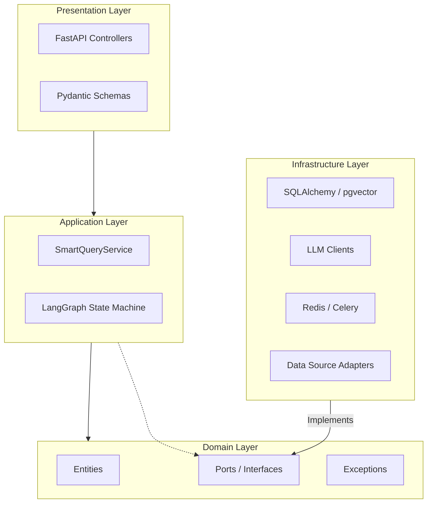

# Architecture

OpenArg follows **Hexagonal Architecture** (Ports & Adapters), with clear separation between domain logic, infrastructure, and presentation.

## Layer Overview



## Directory Structure

```
src/app/
├── domain/                          # Pure business logic (no framework deps)
│   ├── entities/                    # Dataclass entities (BaseEntity → domain objects)
│   │   ├── base.py                  # BaseEntity: id (UUID), created_at, updated_at
│   │   ├── user/user.py             # User: email, name, image_url
│   │   ├── chat/conversation.py     # Conversation: user_id FK, title
│   │   ├── chat/message.py          # Message: conversation_id FK, role, content, sources
│   │   ├── dataset/dataset.py       # Dataset, DatasetChunk (vector embedding)
│   │   ├── dataset/cached_data.py   # CachedDataset (download status tracking)
│   │   ├── query/query.py           # UserQuery, QueryDatasetLink
│   │   └── agent/agent_task.py      # AgentTask (execution log)
│   ├── ports/                       # Abstract interfaces (ABC)
│   │   ├── user/                    # IUserRepository
│   │   ├── chat/                    # IChatRepository
│   │   ├── dataset/                 # IDatasetRepository
│   │   ├── llm/                     # ILLMProvider, IEmbeddingProvider
│   │   ├── search/                  # IVectorSearch
│   │   ├── sandbox/                 # ISQLSandbox
│   │   ├── source/                  # IDataSource
│   │   └── cache/                   # ICacheService
│   └── exceptions/                  # ApplicationError, ErrorCode enum
│
├── infrastructure/                  # Concrete implementations
│   ├── adapters/                    # Port implementations
│   │   ├── user/                    # UserRepositorySQLA
│   │   ├── chat/                    # ChatRepositorySQLA
│   │   ├── dataset/                 # DatasetRepositorySQLA
│   │   ├── llm/                     # Bedrock (primary), Anthropic (fallback) adapters
│   │   ├── search/                  # PgVectorSearchAdapter
│   │   ├── sandbox/                 # PgSandboxAdapter (read-only SQL)
│   │   ├── source/                  # DatosGobAr, CABA CKAN adapters
│   │   └── cache/                   # RedisCacheAdapter
│   ├── persistence_sqla/            # Database layer
│   │   ├── provider.py              # Async engine + session factory
│   │   ├── config.py                # DSN + engine config
│   │   ├── registry.py              # SQLAlchemy imperative mapper
│   │   ├── mappings/                # Table ↔ entity mappings
│   │   └── alembic/                 # Migration files
│   └── celery/                      # Background workers
│       ├── app.py                   # Celery config + queue routing
│       └── tasks/                   # Scraper, collector, embedding, analyst, transparency, ingest, s3
│
├── presentation/                    # HTTP interface
│   └── http/
│       ├── controllers/             # FastAPI routers
│       │   ├── root_router.py       # Composes all routers under /api/v1
│       │   ├── health/              # GET /health, /health/ready
│       │   ├── datasets/            # CRUD + scrape trigger
│       │   ├── query/               # Submit, status, quick, LangGraph smart, WebSocket
│       │   ├── sandbox/             # SQL sandbox + NL2SQL
│       │   ├── conversations/       # Conversation + message CRUD
│       │   ├── taxonomy/            # Taxonomy management
│       │   ├── transparency/       # Transparency data
│       │   ├── admin/              # Admin task management
│       │   └── users/              # User sync (OAuth)
│       └── errors/                  # Exception handlers
│
└── setup/                           # Application bootstrap
    ├── app_factory.py               # FastAPI app creation + middleware
    ├── config/                      # Settings (Pydantic) + TOML loader
    ├── ioc/                         # Dishka DI provider registry
    └── run.py (at src/app/run.py)   # Entry point: make_app()
```

## Dependency Injection (Dishka)

All wiring happens in `setup/ioc/provider_registry.py`. Providers are organized by scope:

### Scope.APP (singletons, created once)

| Provider | Provides | Implementation |
|----------|----------|----------------|
| `SettingsProvider` | `AppSettings` | Loaded from TOML + env |
| `DatabaseProvider` | `AsyncEngine`, `async_sessionmaker` | SQLAlchemy async engine |
| `CacheProvider` | `ICacheService` | `RedisCacheAdapter` |

### Scope.REQUEST (per-request, new instance each time)

| Provider | Provides | Implementation |
|----------|----------|----------------|
| `DatabaseProvider` | `MainAsyncSession` | Async session (yielded, auto-closed) |
| `DatasetProvider` | `IDatasetRepository`, `IVectorSearch` | SQLAlchemy + pgvector |
| `UserProvider` | `IUserRepository` | `UserRepositorySQLA` |
| `ChatProvider` | `IChatRepository` | `ChatRepositorySQLA` |
| `LLMProvider` | `ILLMProvider`, `IEmbeddingProvider` | AWS Bedrock (primary) / Anthropic API (fallback) |
| `DataSourceProvider` | Data source adapters | DatosGobAr, CABA CKAN |
| `SandboxProvider` | `ISQLSandbox` | `PgSandboxAdapter` |

### Injection in Controllers

Controllers use Dishka's FastAPI integration:

```python
from dishka.integrations.fastapi import FromDishka, inject

@router.post("/endpoint")
@inject
async def my_endpoint(
    repo: FromDishka[IUserRepository],
    llm: FromDishka[ILLMProvider],
) -> dict:
    ...
```

## Application Lifecycle

1. `make_app()` in `src/app/run.py` is the entry point (uvicorn factory)
2. `load_settings()` reads TOML config for the current environment
3. `create_app()` creates FastAPI with ORJSONResponse, rate limiter
4. `configure_app()` registers routers, error handlers, CORS
5. `create_async_ioc_container()` wires all DI providers
6. On startup (`lifespan`): `map_tables()` registers SQLAlchemy imperative mappings
7. On shutdown: DI container is closed

## Key Design Decisions

1. **Imperative ORM Mapping** — Entities are pure dataclasses, mapped to tables in `mappings/` modules. This keeps the domain layer free of SQLAlchemy imports.

2. **Async-First** — All I/O uses `async/await`. The only exception is Celery tasks (sync workers) which create their own sync database sessions.

3. **LLM Provider Abstraction** — `ILLMProvider` abstracts over AWS Bedrock (Claude Haiku 3.5) and Anthropic API (Claude Sonnet). The active provider is selected via config.

4. **Vector Search via pgvector** — Embeddings (1024-dim, Cohere Embed Multilingual v3 via Bedrock) are stored in PostgreSQL using the pgvector extension with HNSW indexes for fast approximate nearest neighbor search.

5. **LangGraph Pipeline** — The main query endpoint (`/smart`) runs a LangGraph state machine with nodes for classification, caching, planning, execution, analysis, replanning, and finalization. Supports checkpointing via PostgreSQL.

6. **Dual Query Paths** — Async queries go through Celery (`POST /query/`), synchronous queries go through the quick endpoint (`POST /query/quick`), and the LangGraph pipeline runs via `/smart` (POST) or `/ws/smart` (WebSocket).
