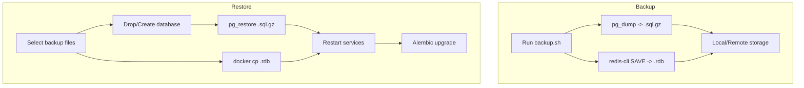

# OpenArg — Backup & Restore

## Estrategia

| Parámetro | Valor |
|-----------|-------|
| **RPO** (Recovery Point Objective) | 24 horas |
| **RTO** (Recovery Time Objective) | 1 hora |
| **Retención** | 7 días (configurable) |
| **Componentes** | PostgreSQL + Redis |

## Process Overview



## Backup

### Ejecución manual

```bash
cd openarg_backend
./scripts/backup.sh [BACKUP_DIR]
```

Variables de entorno opcionales:
- `BACKUP_DIR` — Directorio de destino (default: `/var/backups/openarg`)
- `PG_CONTAINER` — Nombre del container PostgreSQL (default: `openarg_postgres`)
- `REDIS_CONTAINER` — Nombre del container Redis (default: `openarg_redis`)
- `RETENTION_DAYS` — Días de retención (default: `7`)
- `POSTGRES_USER` — Usuario PostgreSQL (default: `openarg`)
- `POSTGRES_DB` — Base de datos (default: `openarg_db`)

### Ejecución automatizada (cron)

```bash
# Backup diario a las 3:00 AM
0 3 * * * cd /opt/openarg/openarg_backend && POSTGRES_USER=openarg POSTGRES_DB=openarg_db REDIS_PASSWORD=xxx ./scripts/backup.sh /var/backups/openarg >> /var/log/openarg-backup.log 2>&1
```

### Qué se respalda

1. **PostgreSQL** — `pg_dump` comprimido (formato custom + gzip)
   - Todas las tablas: datasets, chunks, queries, users, cache
   - Índices pgvector HNSW (se recrean al restore)
   - Extensions (vector)

2. **Redis** — `BGSAVE` + copia de `dump.rdb`
   - Cache de queries
   - Rate limit counters
   - Sesiones de memoria conversacional

## Restore

### Step-by-step

```bash
# 1. Listar backups disponibles
ls -lhtr /var/backups/openarg/

# 2. Restaurar PostgreSQL + Redis
./scripts/restore.sh /var/backups/openarg/pg_openarg_20260301_030000.sql.gz /var/backups/openarg/redis_openarg_20260301_030000.rdb

# 3. Ejecutar migraciones pendientes
docker exec openarg_backend alembic -c alembic.ini upgrade head

# 4. Verificar servicios
curl http://localhost:8080/health
curl http://localhost:8080/api/v1/metrics
```

### Restore solo PostgreSQL

```bash
./scripts/restore.sh /var/backups/openarg/pg_openarg_20260301_030000.sql.gz
```

### Restore solo Redis

```bash
# Copiar dump.rdb y reiniciar
docker cp /var/backups/openarg/redis_openarg_20260301_030000.rdb openarg_redis:/data/dump.rdb
docker restart openarg_redis
```

## Verificación de integridad

Post-restore, verificar:

```bash
# 1. Cantidad de tablas
docker exec openarg_postgres psql -U openarg -d openarg_db -c "\dt"

# 2. Conteo de registros clave
docker exec openarg_postgres psql -U openarg -d openarg_db -c "
SELECT 'datasets' as table_name, count(*) FROM datasets
UNION ALL SELECT 'dataset_chunks', count(*) FROM dataset_chunks
UNION ALL SELECT 'user_queries', count(*) FROM user_queries
UNION ALL SELECT 'query_cache', count(*) FROM query_cache;"

# 3. Verificar pgvector extension
docker exec openarg_postgres psql -U openarg -d openarg_db -c "SELECT extversion FROM pg_extension WHERE extname = 'vector';"

# 4. Verificar índices HNSW
docker exec openarg_postgres psql -U openarg -d openarg_db -c "
SELECT indexname, indexdef FROM pg_indexes WHERE indexdef LIKE '%hnsw%';"

# 5. Health check completo
curl http://localhost:8080/health | python3 -m json.tool

# 6. Redis keys
docker exec openarg_redis redis-cli -a $REDIS_PASSWORD dbsize
```

## Troubleshooting

### pg_restore falla con "relation already exists"

El script de restore ejecuta `DROP DATABASE` + `CREATE DATABASE` antes de restaurar. Si falla:
```bash
docker exec openarg_postgres psql -U openarg -d postgres -c "DROP DATABASE IF EXISTS openarg_db;"
docker exec openarg_postgres psql -U openarg -d postgres -c "CREATE DATABASE openarg_db;"
docker exec openarg_postgres psql -U openarg -d openarg_db -c "CREATE EXTENSION IF NOT EXISTS vector;"
# Reintentar restore
```

### Redis restore no aplica

Verificar que Redis no esté usando `appendonly yes` (AOF). Si usa AOF, desactivar temporalmente:
```bash
docker exec openarg_redis redis-cli -a $REDIS_PASSWORD CONFIG SET appendonly no
# Copiar dump.rdb y reiniciar
docker exec openarg_redis redis-cli -a $REDIS_PASSWORD CONFIG SET appendonly yes
```

### Backup demasiado grande

- Verificar tablas grandes: `SELECT relname, pg_size_pretty(pg_relation_size(oid)) FROM pg_class ORDER BY pg_relation_size(oid) DESC LIMIT 10;`
- Considerar excluir `dataset_chunks` del backup si los embeddings se pueden regenerar
- Usar `pg_dump --exclude-table=dataset_chunks` para backup parcial
