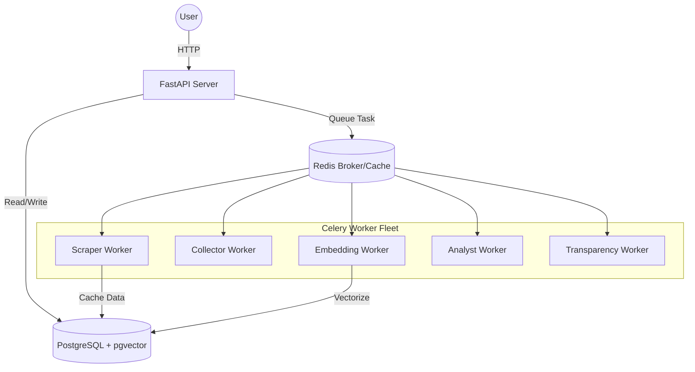

# Deployment

OpenArg is designed to be fully containerized. The system consists of a web API, multiple specialized Celery workers, and necessary infrastructure (PostgreSQL + Redis).

## Deployment Architecture



## Docker Compose (Full Stack)

The `docker-compose.yaml` defines the complete stack:

### Services


| Service | Image | Port | Description |
|---------|-------|------|-------------|
| `postgres` | `pgvector/pgvector:pg16` | 5435 → 5432 | PostgreSQL 16 + pgvector extension |
| `redis` | `redis:7-alpine` | 6381 → 6379 | Broker + cache + results backend |
| `api` | Custom (Dockerfile) | 8081 → 8080 | FastAPI server (runs migrations on start) |
| `worker-scraper` | Custom | — | Celery scraper worker (concurrency 2) |
| `worker-collector` | Custom | — | Celery collector worker (concurrency 4) |
| `worker-embedding` | Custom | — | Celery embedding worker (concurrency 8) |
| `worker-analyst` | Custom | — | Celery analyst worker (concurrency 2) |
| `worker-transparency` | Custom | — | Celery transparency worker (concurrency 2) |
| `worker-ingest` | Custom | — | Celery ingest worker (concurrency 2) |
| `worker-s3` | Custom | — | Celery S3 worker (concurrency 2) |
| `beat` | Custom | — | Celery Beat scheduler |
| `flower` | `mher/flower:2.0.0` | 5556 → 5555 | Celery monitoring UI |

### Volumes

- `pg_data` — PostgreSQL data persistence
- `redis_data` — Redis data persistence

### Health Checks

Both `postgres` and `redis` have health checks. All other services depend on them with `condition: service_healthy`.

### Starting

```bash
# Start everything
make docker.up

# Stop everything
make docker.down
```

The API service automatically runs `alembic upgrade head` before starting uvicorn.

## Local Development

### Prerequisites

- Python 3.12+
- Docker (for PostgreSQL + Redis)
- AWS credentials (for Bedrock + S3)

### Setup

```bash
# 1. Install dependencies
make install

# 2. Start database + Redis
make db.up

# 3. Run migrations
make db.migrate

# 4. Configure credentials
# Set AWS credentials for Bedrock + S3:
export AWS_REGION=us-east-1
export AWS_ACCESS_KEY_ID=your-access-key
export AWS_SECRET_ACCESS_KEY=your-secret-key

# Optional: Anthropic API fallback
# Create config/local/.secrets.toml:
cat > config/local/.secrets.toml << 'EOF'
[anthropic]
API_KEY = "your-anthropic-key"
EOF

# 5. Start dev server
make dev
```

The server starts at `http://localhost:8080` with auto-reload.

### Running Workers Locally

Each worker needs its own terminal:

```bash
# Terminal 1: Scraper
make workers.scraper

# Terminal 2: Collector
make workers.collector

# Terminal 3: Embedding
make workers.embedding

# Terminal 4: Analyst
make workers.analyst

# Terminal 5: Transparency
make workers.transparency

# Terminal 6: Ingest
make workers.ingest

# Terminal 7: S3
make workers.s3

# Terminal 8 (optional): Beat scheduler
make beat

# Terminal 6 (optional): Flower monitoring
make flower    # Opens at http://localhost:5556
```

## Make Commands Reference

| Command | Description |
|---------|-------------|
| `make help` | Show all available commands |
| `make install` | Install dependencies (uv pip) |
| `make dev` | Dev server with auto-reload (port 8080) |
| `make api` | Production server (port 8080, uvloop) |
| `make db.up` | Start PostgreSQL + Redis containers |
| `make db.migrate` | Run Alembic migrations |
| `make db.revision msg="..."` | Create new migration |
| `make workers.scraper` | Start scraper worker |
| `make workers.collector` | Start collector worker |
| `make workers.embedding` | Start embedding worker |
| `make workers.analyst` | Start analyst worker |
| `make workers.transparency` | Start transparency worker |
| `make workers.ingest` | Start ingest worker |
| `make workers.s3` | Start S3 worker |
| `make beat` | Start Celery Beat scheduler |
| `make flower` | Start Flower monitoring (port 5556) |
| `make docker.up` | Start full stack via Docker Compose |
| `make docker.down` | Stop all Docker services |
| `make code.format` | Format code with Ruff |
| `make code.lint` | Lint with Ruff + mypy |
| `make code.test` | Run pytest with coverage |
| `make code.check` | Lint + tests |

## Dependencies

Defined in `pyproject.toml`:

### Runtime

| Package | Version | Purpose |
|---------|---------|---------|
| `fastapi` | >= 0.115.0 | Web framework |
| `uvicorn[standard]` | >= 0.34.0 | ASGI server |
| `uvloop` | >= 0.21.0 | Fast event loop |
| `orjson` | >= 3.10.0 | Fast JSON serialization |
| `websockets` | >= 14.0 | WebSocket support |
| `sqlalchemy[asyncio]` | >= 2.0.36 | ORM (async) |
| `psycopg[binary]` | >= 3.2.0 | PostgreSQL driver |
| `alembic` | >= 1.14.0 | Database migrations |
| `pgvector` | >= 0.2.5 | Vector similarity search |
| `dishka` | >= 1.6.0 | Dependency injection |
| `celery[redis]` | >= 5.4.0 | Background workers |
| `redis` | >= 5.0.0 | Cache + broker client |
| `boto3` | >= 1.35.0 | AWS Bedrock + S3 |
| `anthropic` | >= 0.40.0 | Claude LLM (Anthropic API fallback) |
| `langgraph` | >= 0.3.0 | LangGraph pipeline orchestration |
| `langgraph-checkpoint-postgres` | >= 2.0.0 | LangGraph PostgreSQL checkpointing |
| `pandas` | >= 2.2.0 | Data processing (CSV/JSON/XLSX parsing) |
| `httpx` | >= 0.28.0 | Async HTTP client |
| `pydantic` | >= 2.10.0 | Data validation |
| `slowapi` | >= 0.1.9 | Rate limiting |
| `structlog` | >= 24.4.0 | Structured logging |
| `bcrypt` | >= 4.3.0 | Password hashing |
| `PyJWT[crypto]` | >= 2.10.0 | JWT tokens |

### Dev Dependencies

| Package | Purpose |
|---------|---------|
| `ruff` | Linter + formatter |
| `mypy` | Type checking (strict mode) |
| `pre-commit` | Git hooks |

### Test Dependencies

| Package | Purpose |
|---------|---------|
| `pytest` | Test framework |
| `pytest-asyncio` | Async test support |
| `pytest-cov` | Coverage reports |
| `factory-boy` | Test fixtures |

## Tool Configuration

### Ruff

```toml
[tool.ruff]
target-version = "py312"
line-length = 100
select = ["E", "F", "I", "N", "W", "UP", "B", "SIM", "TCH"]
```

### mypy

```toml
[tool.mypy]
python_version = "3.12"
strict = true
plugins = ["pydantic.mypy"]
```

### pytest

```toml
[tool.pytest.ini_options]
asyncio_mode = "auto"
testpaths = ["tests"]
```
