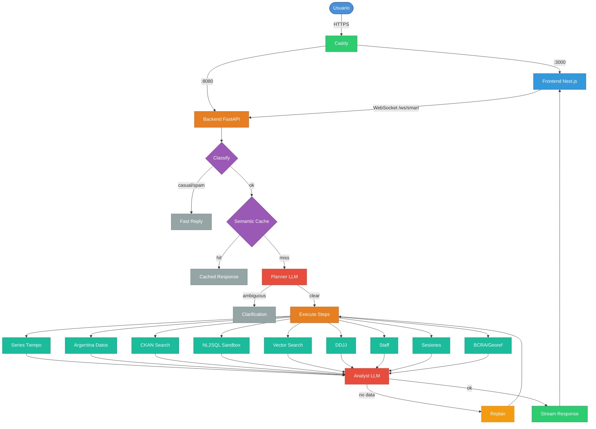
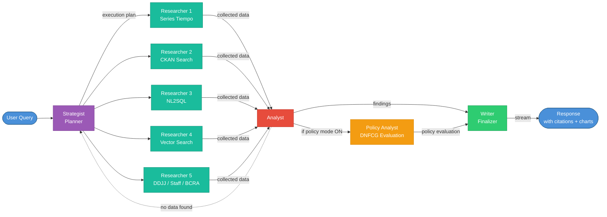
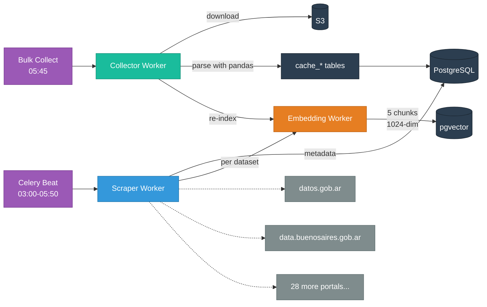
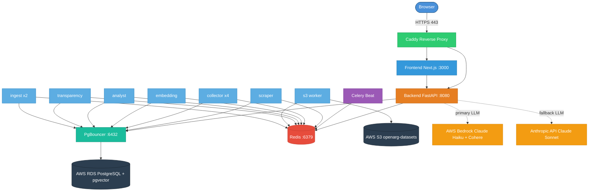

# OpenArg Architecture

## Query Pipeline (user asks a question)

```mermaid
graph TB
    User([Usuario]) -->|HTTPS| Caddy[Caddy]
    Caddy -->|:3000| FE[Frontend Next.js]
    Caddy -->|:8080| BE[Backend FastAPI]
    FE -->|WebSocket /ws/smart| BE

    BE --> Classify{Classify}
    Classify -->|casual/spam| FastReply[Fast Reply]
    Classify -->|ok| Cache{Semantic Cache}
    Cache -->|hit| CacheReply[Cached Response]
    Cache -->|miss| Planner[Planner LLM]
    Planner -->|ambiguous| Clarify[Clarification]
    Planner -->|clear| Execute[Execute Steps]

    Execute --> C1[Series Tiempo]
    Execute --> C2[Argentina Datos]
    Execute --> C3[CKAN Search]
    Execute --> C4[NL2SQL Sandbox]
    Execute --> C5[Vector Search]
    Execute --> C6[DDJJ]
    Execute --> C7[Staff]
    Execute --> C8[Sesiones]
    Execute --> C9[BCRA/Georef]

    C1 & C2 & C3 & C4 & C5 & C6 & C7 & C8 & C9 --> Analyst[Analyst LLM]
    Analyst -->|no data| Replan[Replan] --> Execute
    Analyst -->|ok| Stream[Stream Response] --> FE

    style User fill:#4A90D9,stroke:#2C5F8A,color:#fff
    style Caddy fill:#2ECC71,stroke:#1A9B54,color:#fff
    style FE fill:#3498DB,stroke:#2176AB,color:#fff
    style BE fill:#E67E22,stroke:#BA6318,color:#fff
    style Classify fill:#9B59B6,stroke:#7A3D92,color:#fff
    style Cache fill:#9B59B6,stroke:#7A3D92,color:#fff
    style Planner fill:#E74C3C,stroke:#C0392B,color:#fff
    style Execute fill:#E67E22,stroke:#BA6318,color:#fff
    style C1 fill:#1ABC9C,stroke:#148F77,color:#fff
    style C2 fill:#1ABC9C,stroke:#148F77,color:#fff
    style C3 fill:#1ABC9C,stroke:#148F77,color:#fff
    style C4 fill:#1ABC9C,stroke:#148F77,color:#fff
    style C5 fill:#1ABC9C,stroke:#148F77,color:#fff
    style C6 fill:#1ABC9C,stroke:#148F77,color:#fff
    style C7 fill:#1ABC9C,stroke:#148F77,color:#fff
    style C8 fill:#1ABC9C,stroke:#148F77,color:#fff
    style C9 fill:#1ABC9C,stroke:#148F77,color:#fff
    style Analyst fill:#E74C3C,stroke:#C0392B,color:#fff
    style Replan fill:#F39C12,stroke:#D68910,color:#fff
    style Stream fill:#2ECC71,stroke:#1A9B54,color:#fff
    style FastReply fill:#95A5A6,stroke:#717D7E,color:#fff
    style CacheReply fill:#95A5A6,stroke:#717D7E,color:#fff
    style Clarify fill:#95A5A6,stroke:#717D7E,color:#fff
```

## Multi-Agent Pipeline

```mermaid
graph LR
    User([User Query]) --> Strategist

    Strategist[Strategist\nPlanner] -->|execution plan| R1[Researcher 1\nSeries Tiempo]
    Strategist --> R2[Researcher 2\nCKAN Search]
    Strategist --> R3[Researcher 3\nNL2SQL]
    Strategist --> R4[Researcher 4\nVector Search]
    Strategist --> R5[Researcher 5\nDDJJ / Staff / BCRA]

    R1 & R2 & R3 & R4 & R5 -->|collected data| Analyst[Analyst]

    Analyst -->|if policy mode ON| Policy[Policy Analyst\nDNFCG Evaluation]
    Analyst -->|findings| Writer[Writer\nFinalizer]
    Policy -->|policy evaluation| Writer

    Writer -->|stream| Response([Response\nwith citations + charts])

    Analyst -.->|no data found| Strategist

    style User fill:#4A90D9,stroke:#2C5F8A,color:#fff
    style Strategist fill:#9B59B6,stroke:#7A3D92,color:#fff
    style R1 fill:#1ABC9C,stroke:#148F77,color:#fff
    style R2 fill:#1ABC9C,stroke:#148F77,color:#fff
    style R3 fill:#1ABC9C,stroke:#148F77,color:#fff
    style R4 fill:#1ABC9C,stroke:#148F77,color:#fff
    style R5 fill:#1ABC9C,stroke:#148F77,color:#fff
    style Analyst fill:#E74C3C,stroke:#C0392B,color:#fff
    style Policy fill:#F39C12,stroke:#D68910,color:#fff
    style Writer fill:#2ECC71,stroke:#1A9B54,color:#fff
    style Response fill:#4A90D9,stroke:#2C5F8A,color:#fff
```

## Data Ingestion Pipeline (automatic, daily)

```mermaid
graph LR
    Beat[Celery Beat\n03:00-05:50] --> Scrape[Scraper Worker]
    Scrape -->|metadata| DB[(PostgreSQL)]
    Scrape -->|per dataset| Embed[Embedding Worker]
    Embed -->|5 chunks\n1024-dim| PGV[(pgvector)]

    Bulk[Bulk Collect\n05:45] --> Collect[Collector Worker]
    Collect -->|download| S3[(S3)]
    Collect -->|parse with pandas| Cache[cache_* tables]
    Cache --> DB
    Collect -->|re-index| Embed

    Scrape -.-> P1[datos.gob.ar]
    Scrape -.-> P2[data.buenosaires.gob.ar]
    Scrape -.-> P3[28 more portals...]

    style Beat fill:#9B59B6,stroke:#7A3D92,color:#fff
    style Scrape fill:#3498DB,stroke:#2176AB,color:#fff
    style Embed fill:#E67E22,stroke:#BA6318,color:#fff
    style Collect fill:#1ABC9C,stroke:#148F77,color:#fff
    style Bulk fill:#9B59B6,stroke:#7A3D92,color:#fff
    style DB fill:#2C3E50,stroke:#1A252F,color:#fff
    style PGV fill:#2C3E50,stroke:#1A252F,color:#fff
    style S3 fill:#2C3E50,stroke:#1A252F,color:#fff
    style Cache fill:#2C3E50,stroke:#1A252F,color:#fff
    style P1 fill:#7F8C8D,stroke:#5D6D6E,color:#fff
    style P2 fill:#7F8C8D,stroke:#5D6D6E,color:#fff
    style P3 fill:#7F8C8D,stroke:#5D6D6E,color:#fff
```

## Infrastructure

```mermaid
graph TB
    Browser([Browser]) -->|HTTPS 443| Caddy[Caddy Reverse Proxy]
    Caddy --> FE[Frontend Next.js :3000]
    Caddy --> BE[Backend FastAPI :8080]
    FE --> BE

    BE --> PGB[PgBouncer :6432]
    BE --> Redis[(Redis :6379)]

    Beat[Celery Beat] --> Redis
    W1[scraper] --> Redis
    W2[collector x4] --> Redis
    W3[embedding] --> Redis
    W4[analyst] --> Redis
    W5[transparency] --> Redis
    W6[s3 worker] --> Redis
    W7[ingest x2] --> Redis
    W1 & W2 & W3 & W4 & W5 & W7 --> PGB

    PGB --> RDS[(AWS RDS PostgreSQL + pgvector)]
    W6 --> S3[(AWS S3 openarg-datasets)]
    BE -.->|primary LLM| Bedrock[AWS Bedrock Claude Haiku + Cohere]
    BE -.->|fallback LLM| Anthropic[Anthropic API Claude Sonnet]

    style Browser fill:#4A90D9,stroke:#2C5F8A,color:#fff
    style Caddy fill:#2ECC71,stroke:#1A9B54,color:#fff
    style FE fill:#3498DB,stroke:#2176AB,color:#fff
    style BE fill:#E67E22,stroke:#BA6318,color:#fff
    style PGB fill:#1ABC9C,stroke:#148F77,color:#fff
    style Redis fill:#E74C3C,stroke:#C0392B,color:#fff
    style Beat fill:#9B59B6,stroke:#7A3D92,color:#fff
    style W1 fill:#5DADE2,stroke:#2E86C1,color:#fff
    style W2 fill:#5DADE2,stroke:#2E86C1,color:#fff
    style W3 fill:#5DADE2,stroke:#2E86C1,color:#fff
    style W4 fill:#5DADE2,stroke:#2E86C1,color:#fff
    style W5 fill:#5DADE2,stroke:#2E86C1,color:#fff
    style W6 fill:#5DADE2,stroke:#2E86C1,color:#fff
    style W7 fill:#5DADE2,stroke:#2E86C1,color:#fff
    style RDS fill:#2C3E50,stroke:#1A252F,color:#fff
    style S3 fill:#2C3E50,stroke:#1A252F,color:#fff
    style Bedrock fill:#F39C12,stroke:#D68910,color:#fff
    style Anthropic fill:#F39C12,stroke:#D68910,color:#fff
```
