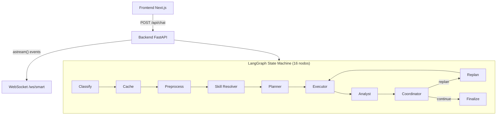
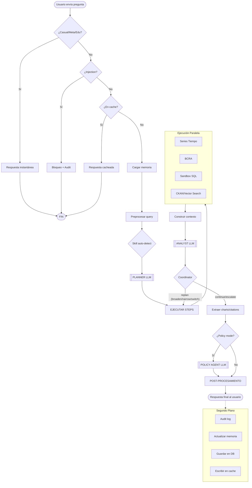

# OpenArg — Mapa del Pipeline de Consultas

## Resumen

Cuando un usuario envía una pregunta, pasa por un pipeline implementado como un **LangGraph state machine** con 16 nodos especializados. El pipeline usa entre **0 y 3 llamadas a LLM** (AWS Bedrock Claude Haiku 4.5) dependiendo del tipo de consulta. Incluye detección automática de skills, coordinación inteligente de replanning con estrategias (broaden/narrow/switch_source), y soporte para acceso por API key pública.

---

## Diagrama General



---

## Pasos del Pipeline

### Paso 0 — Clasificación Rápida (0 LLM)

```
Pregunta del usuario
    │
    ├─ ¿Es saludo/agradecimiento/despedida? → Respuesta casual inmediata
    │   (regex: _CASUAL_PATTERNS)
    │
    ├─ ¿Es meta-pregunta? ("qué podés hacer?") → Respuesta descriptiva
    │   (regex: _META_PATTERNS)
    │
    ├─ ¿Es prompt injection? → Bloqueo + audit log
    │   (prompt_injection_detector.is_suspicious())
    │
    └─ ¿Es pregunta educativa? ("qué es la inflación?") → Respuesta educativa
        (regex: _EDUCATIONAL_PATTERNS)
```

**Si matchea alguno de estos, el pipeline termina acá. 0 llamadas LLM, ~1ms.**

---

### Paso 1 — Cache Lookup

```
Pregunta
    │
    ├─ 1a. Redis cache (hash exacto de la pregunta) → ~1ms
    │       cache key = md5(pregunta.lower().strip())
    │
    └─ 1b. Semantic cache (pgvector, embedding de la pregunta) → ~100-200ms
            busca preguntas semánticamente similares (cosine > 0.95)
            con TTL variable según intent
```

**Si hay cache hit, retorna la respuesta cacheada. 0 llamadas LLM.**

TTL por intent:
- `economic_data`, `series_tiempo` → 1 hora
- `legislative`, `sesiones` → 6 horas
- `ddjj`, `staff` → 24 horas
- Default → 2 horas

---

### Paso 2 — Memoria Conversacional

```
conversation_id → Redis
    │
    └─ Carga el historial de la sesión (últimas N interacciones)
       Se construye un prompt de contexto con lo discutido antes
```

---

### Paso 3 — Preprocesamiento de Query

```
Pregunta original
    │
    ├─ expand_acronyms()     "IPC" → "índice de precios al consumidor (IPC)"
    ├─ normalize_temporal()  "el último mes" → "febrero 2026"
    ├─ normalize_provinces() "bsas" → "buenos aires"
    └─ expand_synonyms()     "sueldo" → "salario"
```

---

### Paso 3b — Detección Automática de Skills (0 LLM)

```
Pregunta preprocesada
    │
    └─ SkillRegistry.match_auto() → regex matching contra 5 skills
       │
       ├─ /verificar  → "es verdad que...", "dijo que...", "aumentó X%"
       ├─ /comparar   → "vs", "comparar", "diferencia entre"
       ├─ /presupuesto → "presupuesto de...", "gasto público", "ejecución"
       ├─ /perfil     → "quién es el diputado...", "patrimonio de..."
       └─ /precio     → "a cuánto está el dólar", "riesgo país"
```

**Si matchea:** Inyecta `planner_injection` (instrucciones obligatorias de qué conectores usar) y `analyst_injection` (formato de respuesta estricto) en los prompts del planner y analyst respectivamente.

**Si no matchea:** Pipeline continúa normal, el planner decide libremente.

**Costo: 0 llamadas LLM** — es regex puro, ~1ms.

---

### Paso 4 — Planificación (1 llamada LLM)

```
Pregunta preprocesada + contexto de memoria
    │
    ▼
generate_plan() → AWS Bedrock Claude Haiku 4.5
    │
    └─ Prompt: planner.txt (con 5 few-shot examples)
       Salida: ExecutionPlan {
           intent: str,          // ej: "economic_data"
           steps: [PlanStep]     // hasta 5 pasos
       }
```

**El planner decide qué conectores usar y en qué orden.**

Fallback automático: si el plan no tiene ningún step de datos, se inyecta `search_datasets` como fallback (búsqueda vectorial).

Ejemplo de plan para "¿cuánto fue la inflación en 2025?":
```json
{
  "intent": "economic_data",
  "steps": [
    {"action": "query_series", "params": {"query": "inflación IPC 2025"}}
  ]
}
```

---

### Paso 5 — Ejecución de Steps (0 LLM)

```
Plan.steps (máx 5)
    │
    ├─ Agrupados por nivel de dependencia
    │   Nivel 0: steps sin dependencias → asyncio.gather() en paralelo
    │   Nivel 1: steps que dependen del nivel 0 → en paralelo entre sí
    │   ...
    │
    └─ Cada step se ejecuta con error handling individual
       (ConnectorError → warning, no rompe el pipeline)
```

#### Conectores disponibles (10):

| Acción | Conector | Fuente de datos |
|--------|----------|-----------------|
| `query_series` | SeriesTiempoAdapter | API Series de Tiempo (datos.gob.ar) — inflación, PBI, tipo de cambio |
| `query_argentina_datos` | ArgentinaDatosAdapter | API argentinadatos.com — dólar, riesgo país, cotizaciones |
| `query_bcra` | BCRAAdapter | API BCRA — reservas, tasas, base monetaria |
| `query_sandbox` | PgSandboxAdapter | SQL read-only sobre tablas cacheadas en PostgreSQL (presupuesto, senado, staff, etc.) |
| `query_ddjj` | DDJJAdapter | Declaraciones juradas patrimoniales (195 diputados, JSON local) |
| `query_sesiones` | SesionesAdapter | Transcripciones de sesiones del Congreso |
| `query_staff` | StaffAdapter | Empleados HCDN + Senado + PEN |
| `query_georef` | GeorefAdapter | API Georef — normalización de direcciones y localidades |
| `search_ckan` | CKANSearchAdapter | Búsqueda en portales CKAN (20 portales activos) |
| `search_datasets` | PgVectorSearchAdapter | Búsqueda híbrida (vector cosine + BM25 full-text con RRF fusion) |

---

### Paso 6 — Construcción del Contexto de Datos

```
DataResult[] de cada conector
    │
    └─ _build_data_context() → string con todos los datos formateados
       Incluye: registros, metadatos, URLs, columnas, scores de relevancia
```

Si no hay resultados, se genera un contexto genérico listando las fuentes disponibles para que el LLM sugiera alternativas en vez de decir "no tengo datos".

---

### Paso 7 — Análisis (1 llamada LLM)

```
Contexto de datos + pregunta + memoria + errores de recolección
    │
    ▼
AWS Bedrock Claude Haiku 3.5 (o Anthropic API Claude Sonnet fallback)
    │
    ├─ System prompt: analyst.txt
    │   • Templates para datos insuficientes
    │   • Reglas anti-alucinación
    │   • Formato de gráficos (<!--CHART:{json}-->)
    │   • Formato de confianza (<!--META:{json}-->)
    │
    └─ Respuesta en markdown con:
       • Análisis del dato
       • Gráficos embebidos (opcional)
       • Confianza y citas
       • Preguntas de seguimiento sugeridas
```

---

### Paso 8 — Extracción de Gráficos

```
Respuesta del LLM
    │
    ├─ Gráficos determinísticos (datos de series/BCRA con formato predecible)
    │   Se prefieren sobre los del LLM por ser más confiables
    │
    └─ Gráficos LLM (<!--CHART:{json}-->)
       Tipos: line, bar, pie, area, heatmap, scatter
```

---

### Paso 9 — Confianza y Citas

```
Respuesta del LLM
    │
    ├─ <!--META:{"confidence": 0.85, "citations": [...]}-->
    │
    └─ Si confidence < 0.5 → se agrega disclaimer:
       "La información disponible es limitada..."
```

---

### Paso 9b — Coordinación y Replan Inteligente (0 LLM)

```
Resultados del analyst
    │
    ▼
coordinator_node() → heurístico, sin LLM
    │
    ├─ ¿Tiene datos útiles? → "continue" → finalize
    │
    ├─ ¿Time budget > 20s? → "escalate" → finalize con lo que hay
    │
    ├─ ¿3+ fallos de conectores? → "escalate"
    │
    ├─ ¿replan_count >= 2? → "escalate"
    │
    └─ Replan con estrategia:
       ├─ 1er intento: "broaden"      → ampliar búsqueda
       ├─ 2do intento: "switch_source" → probar conectores diferentes
       └─ 2do intento: "narrow"       → enfocar si hay datos parciales
```

El `replan_node` recibe la estrategia y genera contexto específico para el planner:
- **broaden**: "Probá search_datasets, query_sandbox con tablas generales"
- **switch_source**: "Los conectores anteriores fallaron, usá fuentes DIFERENTES"
- **narrow**: "Hay datos parciales, sé más específico con filtros"

**Máximo 2 replans** (3 intentos totales). Costo: 0 LLM para la decisión, 1 LLM por replan (planner call).

---

### Paso 9c — Análisis de Política (opcional, 1 llamada LLM)

Solo se ejecuta si `policy_mode=True`.

```
Datos + plan + respuesta del analista
    │
    ▼
analyze_policy() → LLM adicional
    │
    └─ Agrega análisis de política pública al final de la respuesta
```

---

### Paso 10 — Post-procesamiento

Estas acciones se ejecutan en paralelo después de generar la respuesta:

```
Respuesta final
    │
    ├─ 10a. Audit log → audit_query(user, question, intent, duration_ms)
    │
    ├─ 10b. Actualización de memoria → update_memory() + save_memory()
    │        (1 llamada LLM para resumir la interacción)
    │
    ├─ 10c. Guardar en historial → INSERT en user_queries (PostgreSQL)
    │
    └─ 10d. Cache write
            ├─ Redis → hash exacto, TTL según intent
            └─ Semantic cache → embedding + pgvector, TTL según intent
```

---

## Pipeline Completo — Diagrama de Flujo



---

## Tiempos Aproximados

| Paso | Tiempo típico |
|------|--------------|
| Clasificación rápida | ~1ms |
| Cache Redis | ~1-5ms |
| Cache semántico | ~100-200ms |
| Preprocesamiento | ~5ms |
| Planner (LLM) | ~1-3s |
| Ejecución de steps | ~500ms-5s (depende de APIs externas) |
| Analyst (LLM) | ~2-5s |
| Policy (LLM, opcional) | ~2-4s |
| Post-procesamiento | ~100-500ms |
| **Total sin cache** | **~4-15s** |
| **Total con cache** | **~1-200ms** |

---

## Modo Streaming (WebSocket)

El endpoint WS `/api/v1/query/ws/smart` emite eventos en tiempo real via LangGraph `astream()`:

```
→ {"type": "status", "step": "classifying"}
→ {"type": "status", "step": "skill", "detail": "Verificación de afirmaciones..."}  (si skill detectada)
→ {"type": "status", "step": "planning"}
→ {"type": "status", "step": "planned", "intent": "...", "steps_count": N}
→ {"type": "status", "step": "searching", "detail": "Consultando Series de Tiempo..."}
→ {"type": "status", "step": "generating"}
→ {"type": "chunk", "content": "texto parcial..."}   (múltiples)
→ {"type": "status", "step": "coordination", "detail": "Replanificando: ampliando búsqueda..."}  (si replan)
→ {"type": "complete", "answer": "...", "sources": [...], "chart_data": [...]}
```

---

## Endpoint NL2SQL (separado)

El endpoint `POST /api/v1/sandbox/ask` tiene su propio pipeline simplificado:

```
Pregunta en lenguaje natural
    │
    ▼
Listar tablas disponibles (cache_*)
    │
    ▼
Obtener column types (information_schema)
    │
    ▼
LLM genera SQL (nl2sql.txt prompt + few-shot examples)
    │
    ▼
Ejecutar SQL read-only con 4 capas de seguridad:
    1. Regex (bloquea INSERT/UPDATE/DELETE/DROP)
    2. sqlglot AST (valida que sea solo SELECT)
    3. SET TRANSACTION READ ONLY
    4. Usuario PostgreSQL read-only (openarg_sandbox_ro)
    │
    ├─ Si error → self-correction loop (hasta 2 reintentos con LLM)
    │
    └─ Retorna resultados + SQL generado
```
