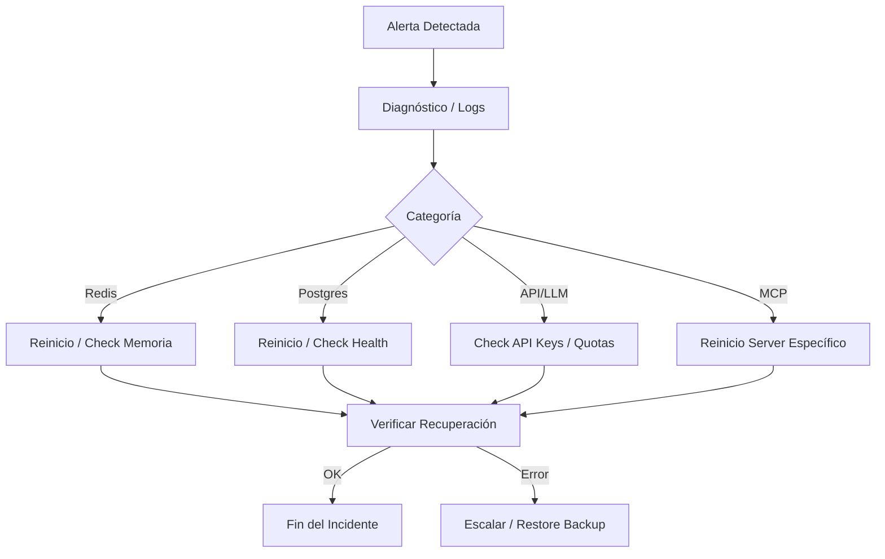

# OpenArg — Runbook Operativo

Procedimientos de respuesta a incidentes y operación del sistema en producción.

---

## Flujo de Resolución de Incidentes



---

## 1. Redis caído

**Impacto**: Cache miss en todas las queries, rate limiting degradado (fallback a memoria), sesiones WS sin throttling.

**Diagnóstico**:
```bash
docker exec openarg_redis redis-cli -a $REDIS_PASSWORD ping
docker logs openarg_redis --tail 50
```

**Recovery**:
```bash
docker restart openarg_redis
# Verificar
docker exec openarg_redis redis-cli -a $REDIS_PASSWORD info memory
```

**Nota**: La aplicación funciona sin Redis (degradación graceful) — cache misses aumentan latencia y carga LLM.

---

## 2. PostgreSQL caído

**Impacto**: Todas las queries que requieren pgvector, historial, semantic cache y sesiones fallan. Health check reporta unhealthy.

**Diagnóstico**:
```bash
docker exec openarg_postgres pg_isready -U $POSTGRES_USER
docker logs openarg_postgres --tail 50
```

**Recovery**:
```bash
docker restart openarg_postgres
# Si la data está corrupta:
./scripts/restore.sh /var/backups/openarg/pg_openarg_LATEST.sql.gz
# Post-restore:
docker exec openarg_backend alembic -c alembic.ini upgrade head
```

---

## 3. MCP server no responde

**Impacto**: El connector correspondiente falla, pero otros connectors continúan (graceful degradation).

**Diagnóstico**:
```bash
# Verificar health de cada server
curl -f http://localhost:8091/health  # series_tiempo
curl -f http://localhost:8092/health  # ckan
curl -f http://localhost:8093/health  # argentina_datos
curl -f http://localhost:8094/health  # sesiones

# Logs
docker logs openarg_mcp_series_tiempo --tail 30
```

**Recovery**:
```bash
docker restart openarg_mcp_series_tiempo  # o el server afectado
```

**Circuit breaker**: Después de 5 fallos consecutivos, el circuit breaker se abre por 60 segundos (timeout configurable). No requiere intervención manual — se recupera en HALF_OPEN automáticamente.

---

## 4. LLM provider errores

**Impacto**: Queries que requieren análisis LLM fallan. Respuestas casuales, educativas y meta NO se ven afectadas.

**Diagnóstico**:
```bash
# Check Prometheus metrics
curl localhost:8080/api/v1/metrics/prometheus | grep openarg_llm_calls_total
# Check logs
docker logs openarg_backend --tail 100 | grep "LLM\|Gemini\|Anthropic"
```

**Fallback chain**: Gemini (primary) → Anthropic (fallback). Si ambos fallan:
1. Verificar API keys en `.env`
2. Verificar cuotas/billing en consolas de Gemini y Anthropic
3. Verificar conectividad de salida (firewall)

---

## 5. Alta latencia

**Dónde mirar**:

1. **Prometheus dashboard**:
   ```bash
   curl localhost:8080/api/v1/metrics/prometheus | grep duration
   ```

2. **Métricas por connector**:
   ```bash
   curl localhost:8080/api/v1/metrics | python3 -m json.tool
   ```
   Revisar `connectors.*.avg_latency_ms` — identificar qué connector está lento.

3. **Logs con timing**:
   ```bash
   docker logs openarg_backend --tail 200 | grep "duration_ms\|step.*failed\|latency"
   ```

4. **Header de respuesta**: Cada request incluye `X-Response-Time-Ms`.

**Acciones**:
- Si es un connector externo → verificar API externa, aumentar timeout
- Si es LLM → reducir max_tokens, verificar load del provider
- Si es pgvector → verificar índices HNSW, VACUUM tables
- Si es Redis → verificar memoria (`INFO memory`), eviction policy

---

## 6. Prompt injection spike

**Diagnóstico**:
```bash
# Audit logs
docker logs openarg_backend | grep "injection_blocked"
# Prometheus
curl localhost:8080/api/v1/metrics/prometheus | grep "SEC_001"
```

**Acciones**:
1. Identificar IP/API key del atacante en audit logs
2. Bloquear IP en Caddy/firewall:
   ```
   # Caddyfile
   @blocked remote_ip <IP>
   respond @blocked "Forbidden" 403
   ```
3. Si los patrones son nuevos, actualizar `prompt_injection_detector.py`

---

## 7. Disk space

**Diagnóstico**:
```bash
df -h /var/lib/docker
docker system df
```

**Acciones**:
- **PostgreSQL VACUUM**:
  ```bash
  docker exec openarg_postgres psql -U $POSTGRES_USER -d $POSTGRES_DB -c "VACUUM FULL ANALYZE;"
  ```
- **Purge old embeddings** (dataset_chunks older than 30 days):
  ```sql
  DELETE FROM dataset_chunks WHERE created_at < NOW() - INTERVAL '30 days';
  VACUUM dataset_chunks;
  ```
- **Docker cleanup**:
  ```bash
  docker system prune -f --volumes  # CUIDADO: borra volumes no usados
  docker image prune -f
  ```
- **Backup rotation**: Ajustar `RETENTION_DAYS` en `scripts/backup.sh`

---

## 8. Scaling horizontal

### Workers
Escalar workers independientemente:
```bash
docker compose -f docker-compose.prod.yml up -d --scale worker-scraper=2 --scale worker-analyst=3
```

### API replicas
Aumentar workers de Uvicorn (modificar comando en compose):
```yaml
command: >
  uvicorn app.run:make_app --factory --host 0.0.0.0 --port 8080 --loop uvloop --workers 4
```

### MCP servers
Cada MCP server puede tener múltiples réplicas detrás de un load balancer interno:
```yaml
mcp-series-tiempo:
  deploy:
    replicas: 2
```

### PostgreSQL
- Para read-heavy loads: agregar réplica de lectura
- Para write-heavy: considerar pgBouncer como connection pooler

### Redis
- Para cache-heavy: Redis Cluster o Redis Sentinel para HA
- Evaluar `maxmemory-policy allkeys-lru` si la memoria es limitada

