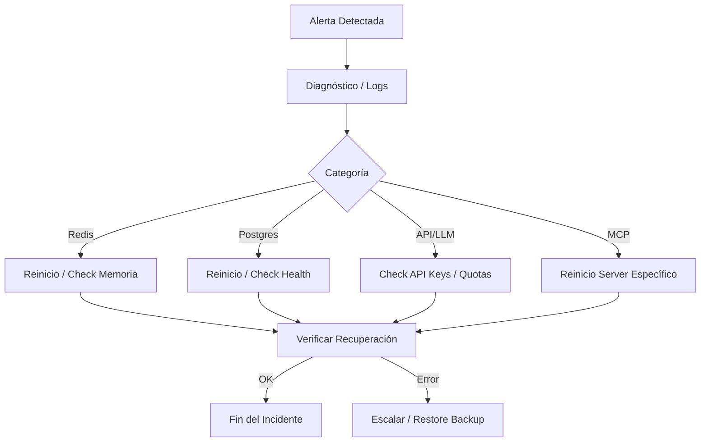

# OpenArg — Runbook Operativo

Procedimientos de respuesta a incidentes y operación del sistema en producción.

---

## Flujo de Resolución de Incidentes


```mermaid
graph TD
    Alert[Alerta Detectada] --> Diag[Diagnóstico / Logs]
    Diag --> Category{Categoría}
    
    Category -->|Redis| R1[Reinicio / Check Memoria]
    Category -->|Postgres| P1[Reinicio / Check Health]
    Category -->|API/LLM| A1[Check API Keys / Quotas]
    Category -->|MCP| M1[Reinicio Server Específico]
    
    R1 --> Verify[Verificar Recuperación]
    P1 --> Verify
    A1 --> Verify
    M1 --> Verify
    
    Verify -->|OK| End[Fin del Incidente]
    Verify -->|Error| Escalation[Escalar / Restore Backup]
```

---

## 1. Redis caído

**Impacto**: Cache miss en todas las queries, rate limiting degradado (fallback a memoria), sesiones WS sin throttling.

**Diagnóstico**:
```bash
docker exec openarg_redis redis-cli -a $REDIS_PASSWORD ping
docker logs openarg_redis --tail 50
```

**Recovery**:
```bash
docker restart openarg_redis
# Verificar
docker exec openarg_redis redis-cli -a $REDIS_PASSWORD info memory
```

**Nota**: La aplicación funciona sin Redis (degradación graceful) — cache misses aumentan latencia y carga LLM.

---

## 2. PostgreSQL caído

**Impacto**: Todas las queries que requieren pgvector, historial, semantic cache y sesiones fallan. Health check reporta unhealthy.

**Diagnóstico**:
```bash
docker exec openarg_postgres pg_isready -U $POSTGRES_USER
docker logs openarg_postgres --tail 50
```

**Recovery**:
```bash
docker restart openarg_postgres
# Si la data está corrupta:
./scripts/restore.sh /var/backups/openarg/pg_openarg_LATEST.sql.gz
# Post-restore:
docker exec openarg_backend alembic -c alembic.ini upgrade head
```

---

## 3. MCP server no responde

**Impacto**: El connector correspondiente falla, pero otros connectors continúan (graceful degradation).

**Diagnóstico**:
```bash
# Verificar health de cada server
curl -f http://localhost:8091/health  # series_tiempo
curl -f http://localhost:8092/health  # ckan
curl -f http://localhost:8093/health  # argentina_datos
curl -f http://localhost:8094/health  # sesiones

# Logs
docker logs openarg_mcp_series_tiempo --tail 30
```

**Recovery**:
```bash
docker restart openarg_mcp_series_tiempo  # o el server afectado
```

**Circuit breaker**: Después de 5 fallos consecutivos, el circuit breaker se abre por 60 segundos (timeout configurable). No requiere intervención manual — se recupera en HALF_OPEN automáticamente.

---

## 4. LLM provider errores

**Impacto**: Queries que requieren análisis LLM fallan. Respuestas casuales, educativas y meta NO se ven afectadas.

**Diagnóstico**:
```bash
# Check Prometheus metrics
curl localhost:8080/api/v1/metrics/prometheus | grep openarg_llm_calls_total
# Check logs
docker logs openarg_backend --tail 100 | grep "LLM\|Gemini\|Anthropic"
```

**Fallback chain**: Gemini (primary) → Anthropic (fallback). Si ambos fallan:
1. Verificar API keys en `.env`
2. Verificar cuotas/billing en consolas de Gemini y Anthropic
3. Verificar conectividad de salida (firewall)

---

## 5. Alta latencia

**Dónde mirar**:

1. **Prometheus dashboard**:
   ```bash
   curl localhost:8080/api/v1/metrics/prometheus | grep duration
   ```

2. **Métricas por connector**:
   ```bash
   curl localhost:8080/api/v1/metrics | python3 -m json.tool
   ```
   Revisar `connectors.*.avg_latency_ms` — identificar qué connector está lento.

3. **Logs con timing**:
   ```bash
   docker logs openarg_backend --tail 200 | grep "duration_ms\|step.*failed\|latency"
   ```

4. **Header de respuesta**: Cada request incluye `X-Response-Time-Ms`.

**Acciones**:
- Si es un connector externo → verificar API externa, aumentar timeout
- Si es LLM → reducir max_tokens, verificar load del provider
- Si es pgvector → verificar índices HNSW, VACUUM tables
- Si es Redis → verificar memoria (`INFO memory`), eviction policy

---

## 6. Prompt injection spike

**Diagnóstico**:
```bash
# Audit logs
docker logs openarg_backend | grep "injection_blocked"
# Prometheus
curl localhost:8080/api/v1/metrics/prometheus | grep "SEC_001"
```

**Acciones**:
1. Identificar IP/API key del atacante en audit logs
2. Bloquear IP en Caddy/firewall:
   ```
   # Caddyfile
   @blocked remote_ip <IP>
   respond @blocked "Forbidden" 403
   ```
3. Si los patrones son nuevos, actualizar `prompt_injection_detector.py`

---

## 7. Disk space

**Diagnóstico**:
```bash
df -h /var/lib/docker
docker system df
```

**Acciones**:
- **PostgreSQL VACUUM**:
  ```bash
  docker exec openarg_postgres psql -U $POSTGRES_USER -d $POSTGRES_DB -c "VACUUM FULL ANALYZE;"
  ```
- **Purge old embeddings** (dataset_chunks older than 30 days):
  ```sql
  DELETE FROM dataset_chunks WHERE created_at < NOW() - INTERVAL '30 days';
  VACUUM dataset_chunks;
  ```
- **Docker cleanup**:
  ```bash
  docker system prune -f --volumes  # CUIDADO: borra volumes no usados
  docker image prune -f
  ```
- **Backup rotation**: Ajustar `RETENTION_DAYS` en `scripts/backup.sh`

---

## 8. Scaling horizontal

### Workers
Escalar workers independientemente:
```bash
docker compose -f docker-compose.prod.yml up -d --scale worker-scraper=2 --scale worker-analyst=3
```

### API replicas
Aumentar workers de Uvicorn (modificar comando en compose):
```yaml
command: >
  uvicorn app.run:make_app --factory --host 0.0.0.0 --port 8080 --loop uvloop --workers 4
```

### MCP servers
Cada MCP server puede tener múltiples réplicas detrás de un load balancer interno:
```yaml
mcp-series-tiempo:
  deploy:
    replicas: 2
```

### PostgreSQL
- Para read-heavy loads: agregar réplica de lectura
- Para write-heavy: considerar pgBouncer como connection pooler

### Redis
- Para cache-heavy: Redis Cluster o Redis Sentinel para HA
- Evaluar `maxmemory-policy allkeys-lru` si la memoria es limitada

---

## 9. Series de tiempo: volver atrás una tabla `raw.cache_series_*`

El ETL de series (`ingest_series_tiempo`) no borra la tabla que reemplaza: la
deja como `raw.<tabla>__previa`, con sus filas, sus tipos y sus permisos. Hay
una sola previa por tabla, la de la escritura anterior; la siguiente escritura
la pisa. Después de una vuelta atrás, la previa es la escritura descartada.
`cleanup_invariants` no la registra, así que no aparece en el catálogo ni en
`/data/tables`.

1. Frenar la ingesta para que no vuelva a escribir la tabla restaurada:
   `OPENARG_BEAT_DESACTIVADAS=ingest-series-tiempo,check-series-freshness` en
   el `.env` y recrear `beat` y los workers (ver `docs/deploy-produccion.md`).
2. Intercambiar la tabla viva con la previa, en una transacción. La escritura
   descartada queda como la nueva `__previa`: `cleanup_invariants` no la
   registra y la próxima escritura la borra. No dejarla con otro nombre: el
   pase de huérfanas de `cleanup_invariants` (cada hora, a los :15) registra
   toda tabla de `raw` sin fila en el registro, salvo las `__previa`, y
   `/data/tables`, el modo datos del MCP y el NL2SQL la servirían como tabla
   viva, con los datos que se acaban de descartar.

   ```sql
   BEGIN;
   ALTER TABLE raw."cache_series_<clave>" RENAME TO "cache_series_<clave>__tmp";
   ALTER TABLE raw."cache_series_<clave>__previa" RENAME TO "cache_series_<clave>";
   ALTER TABLE raw."cache_series_<clave>__tmp" RENAME TO "cache_series_<clave>__previa";
   COMMIT;
   ```

   Correrlo otra vez deshace la vuelta atrás (y después hay que repetir el
   paso 3).

   **Desempleo:** si la primera corrida con el arreglo de H023 encuentra la
   tabla en fracción (máximo 0,204), la reescribe en porcentaje (20,4) aunque
   esté al día en fechas y filas: sale con motivo `escala`. Pasa también si la
   dejó así un ETL sin la escala, como el de ola-2 desplegado antes que este
   arreglo. Esa escritura deja como previa la de la fracción, y como la serie
   es trimestral, esa previa puede durar meses. Volver atrás con ella vuelve a
   servir la fracción bajo «Tasa de desempleo total. En porcentaje.», que es
   H023, hasta que la próxima corrida la escale de nuevo. Antes del cambio,
   mirarla:
   `SELECT max("Tasa de desempleo total. En porcentaje.") FROM raw."cache_series_desempleo__previa";`.
   Si no pasa de 1,5, es la fracción: conviene corregir la escritura nueva en
   vez de volver atrás.

3. La metadata sigue describiendo la versión descartada. Alinear las filas:

   ```sql
   BEGIN;
   WITH n AS (SELECT count(*) AS filas FROM raw."cache_series_<clave>")
   UPDATE raw.cached_datasets SET row_count = n.filas FROM n
    WHERE table_name = 'cache_series_<clave>';
   WITH n AS (SELECT count(*) AS filas FROM raw."cache_series_<clave>")
   UPDATE public.raw_table_versions SET row_count = n.filas FROM n
    WHERE schema_name = 'raw' AND table_name = 'cache_series_<clave>';
   WITH n AS (SELECT count(*) AS filas FROM raw."cache_series_<clave>")
   UPDATE datasets SET row_count = n.filas FROM n
    WHERE portal = 'series_tiempo' AND source_id = 'series-tiempo-<clave>';
   COMMIT;
   ```

   Si la escritura descartada cambió de serie (otro id), `datasets.url`,
   `title`, `description` y `columns` también quedaron con la serie nueva:
   volverlos a los de la vieja a mano. Y mientras el catálogo del adaptador y
   `CAMBIOS_DE_SERIE_APROBADOS` (en `series_tiempo_tasks.py`) digan la serie
   nueva, la próxima corrida la vuelve a escribir: sacar la aprobación en un
   PR antes de volver a agendar la ingesta.

Mientras la ingesta esté frenada, la tabla restaurada no se actualiza. Antes de
volver a agendarla, corregir lo que hizo mala la escritura descartada: la
primera corrida va a comparar la tabla contra la API y reescribirla si está
atrás o, en una tasa que se guarda en porcentaje como el desempleo, si quedó
en fracción.


---

## 10. Declaraciones juradas: volver atrás `raw.cache_ddjj_*`

La carga de DDJJ (`ingest_ddjj_oa`, entrada del beat `ingest-ddjj-oa`) reemplaza
las tres tablas juntas, `cache_ddjj_declaraciones`, `cache_ddjj_bienes` y
`cache_ddjj_deudas`, y deja las anteriores como `<tabla>__previa`. Igual que en
las series, hay una sola previa por tabla y la siguiente escritura la pisa.
Cada corrida queda anotada en `public.ddjj_cargas`, con el plan (qué archivo de
la Oficina Anticorrupción se usó para cada año y qué cortes se descartaron) y
las filas por año.

1. Frenar la carga: `OPENARG_BEAT_DESACTIVADAS=ingest-ddjj-oa` en el `.env` y
   recrear `beat`. Si no, el lunes siguiente vuelve a escribir.
2. Intercambiar las tres juntas, en una transacción. Las tres son de la misma
   carga, y el detalle se une a las declaraciones por `dj_id`.

   ```sql
   BEGIN;
   ALTER TABLE raw."cache_ddjj_declaraciones" RENAME TO "cache_ddjj_declaraciones__tmp";
   ALTER TABLE raw."cache_ddjj_declaraciones__previa" RENAME TO "cache_ddjj_declaraciones";
   ALTER TABLE raw."cache_ddjj_declaraciones__tmp" RENAME TO "cache_ddjj_declaraciones__previa";
   ALTER TABLE raw."cache_ddjj_bienes" RENAME TO "cache_ddjj_bienes__tmp";
   ALTER TABLE raw."cache_ddjj_bienes__previa" RENAME TO "cache_ddjj_bienes";
   ALTER TABLE raw."cache_ddjj_bienes__tmp" RENAME TO "cache_ddjj_bienes__previa";
   ALTER TABLE raw."cache_ddjj_deudas" RENAME TO "cache_ddjj_deudas__tmp";
   ALTER TABLE raw."cache_ddjj_deudas__previa" RENAME TO "cache_ddjj_deudas";
   ALTER TABLE raw."cache_ddjj_deudas__tmp" RENAME TO "cache_ddjj_deudas__previa";
   COMMIT;
   ```

   Los índices quedan con los nombres de antes del intercambio. No hace falta
   renombrarlos: la carga siguiente borra la previa con sus índices antes de
   poner los nombres canónicos.
3. La carga no vuelve a bajar nada mientras la fuente no cambie: compara el
   manifiesto de CKAN con el de la última carga `escrita`. Para que reescriba
   después de arreglar lo que hizo mala la carga descartada, correrla a mano
   con `forzar=True`.
