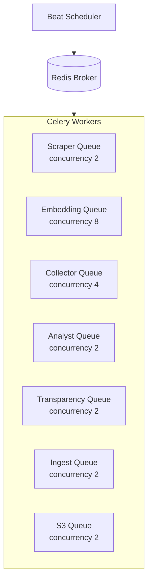
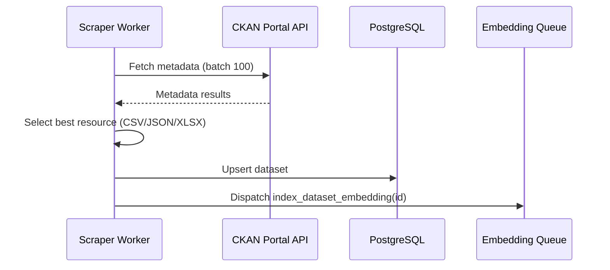
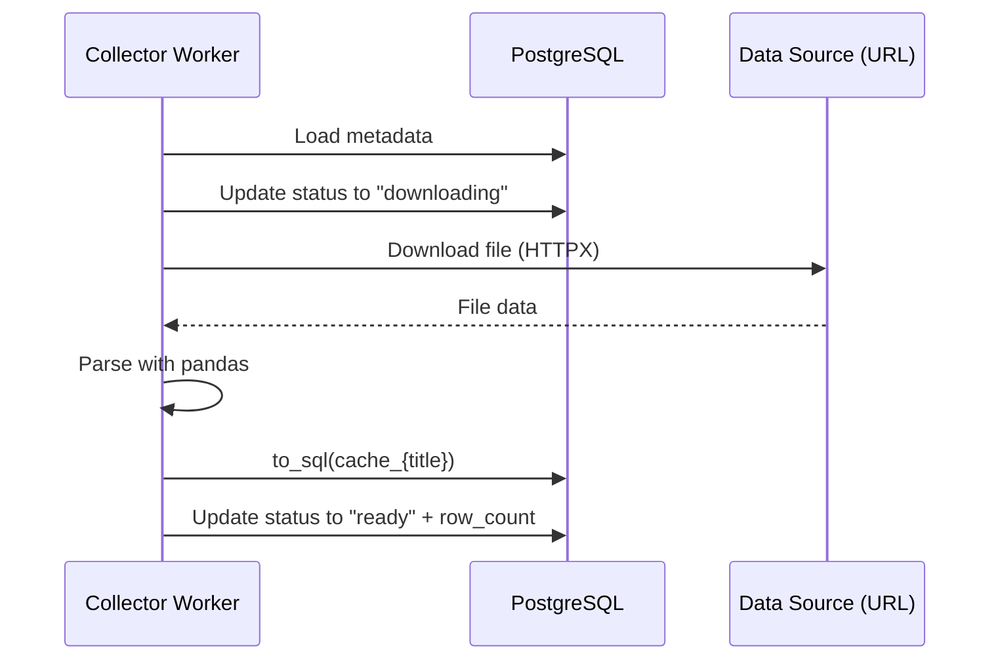
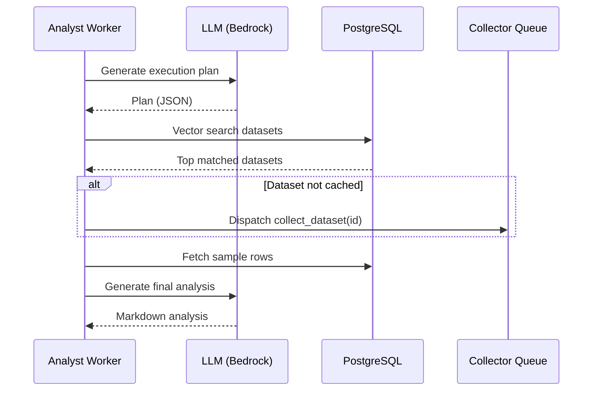

# Worker Pipeline

OpenArg uses Celery with Redis as broker for background processing. The system runs 7+ specialized worker types, each with its own queue.

## Architecture



## Celery Configuration (`infrastructure/celery/app.py`)

```python
# Queue routing
task_routes = {
    "app.infrastructure.celery.tasks.scraper_tasks.*": {"queue": "scraper"},
    "app.infrastructure.celery.tasks.embedding_tasks.*": {"queue": "embedding"},
    "app.infrastructure.celery.tasks.collector_tasks.*": {"queue": "collector"},
    "app.infrastructure.celery.tasks.analyst_tasks.*": {"queue": "analyst"},
}

# Worker settings
worker_prefetch_multiplier = 4
worker_max_tasks_per_child = 500
```

## Tasks

### Scraper Tasks (`tasks/scraper_tasks.py`)

#### `scrape_catalog(portal, batch_size=100)`

Fetches dataset metadata from CKAN portals and indexes them.

**Flow:**
1. Fetch total count from portal API.
2. Paginate through results in batches of 100.
3. For each dataset, extract metadata (title, description, organization, resources).
4. Select best resource (prefer CSV > JSON > XLSX).
5. Upsert dataset into PostgreSQL.
6. Dispatch `index_dataset_embedding.delay(dataset_id)` for each new/updated dataset.

**Task Flow:**


**Supported portals:**
- `datos_gob_ar` — datos.gob.ar (national)
- `caba` — data.buenosaires.gob.ar (Buenos Aires city)

#### `index_dataset_embedding(dataset_id)`

Generates vector embeddings for a dataset's metadata.

**Flow:**
1. Load dataset from DB.
2. Generate 3 text chunks:
   - **Chunk 1 (Main):** Title + description + organization + tags + format + row_count
   - **Chunk 2 (Columns):** Column names + contextual description
   - **Chunk 3 (Use-case):** How to query, what data is available, relevance hints
3. Delete existing chunks for this dataset.
4. Batch embed all chunks via AWS Bedrock Cohere Embed Multilingual v3 (1024 dims).
5. Insert chunks with embeddings into `dataset_chunks` table.

### Embedding Tasks (`tasks/embedding_tasks.py`)

#### `reindex_all_embeddings(portal=None)`

Re-generates embeddings for all datasets (or filtered by portal).

Dispatches `index_dataset_embedding.delay()` for each dataset.

### Collector Tasks (`tasks/collector_tasks.py`)

#### `collect_dataset(dataset_id)`

Downloads a dataset file and caches it as a PostgreSQL table.

**Flow:**
1. Load dataset metadata from DB.
2. Check if already cached (status = "ready").
3. Create `cached_datasets` entry with status "downloading".
4. Download file via HTTPX.
5. Parse with pandas (supports CSV, JSON, XLSX).
6. Sanitize table name: `cache_{lowercase_alphanumeric_title}`.
7. Limit to 500k rows.
8. Write to PostgreSQL via `pandas.to_sql()`.
9. Update cached_datasets with status "ready", row_count, columns_json.
10. Update parent dataset: `is_cached=True`, `row_count`.

**Task Flow:**


### Analyst Tasks (`tasks/analyst_tasks.py`)

#### `analyze_query(query_id, question)`

Full multi-agent analysis pipeline.

**Flow:**
1. **Plan Phase** — LLM (AWS Bedrock Claude Haiku 3.5) generates JSON execution plan:
   ```json
   {
     "approach": "...",
     "datasets_needed": ["tipo1", "tipo2"],
     "analysis_steps": ["step1", "step2"]
   }
   ```
2. **Search Phase** — Generate embedding for the question, vector search top-5 datasets.
3. **Gather Phase** — For each matched dataset:
   - Ensure data is cached (dispatch collector if needed).
   - Fetch sample rows (20 rows max) from cached tables.
4. **Analyze Phase** — LLM generates final analysis using:
   - Original question
   - Dataset metadata
   - Real sample data (when available)
   - Execution plan context

**Task Flow:**


**Status progression:** `pending` → `planning` → `collecting` → `analyzing` → `completed` (or `error`)

Each phase is logged as an `AgentTask` entry with input/output JSON, tokens used, and duration.

## Scheduled Jobs (Celery Beat)

Configured in `celery/app.py`:

| Schedule | Task | Arguments |
|----------|------|-----------|
| Daily 03:00 ART | `scrape_catalog` | `portal="datos_gob_ar"` |
| Daily 03:30 ART | `scrape_catalog` | `portal="caba"` |

## Running Workers

```bash
# Individual workers
make workers.scraper        # Scraper queue, concurrency 2
make workers.collector      # Collector queue, concurrency 4
make workers.embedding      # Embedding queue, concurrency 8
make workers.analyst        # Analyst queue, concurrency 2
make workers.transparency   # Transparency queue, concurrency 2
make workers.ingest         # Ingest queue, concurrency 2
make workers.s3             # S3 queue, concurrency 2

# Scheduler
make beat               # Celery Beat for scheduled tasks

# Monitoring
make flower             # Flower UI on port 5556
```

## Docker Compose Workers

In production/docker, each worker runs as a separate container:

| Service | Queue | API Keys / Credentials Needed |
|---------|-------|-------------------------------|
| `worker-scraper` | scraper | AWS credentials (Bedrock embeddings) |
| `worker-collector` | collector | — |
| `worker-embedding` | embedding | AWS credentials (Bedrock Cohere) |
| `worker-analyst` | analyst | AWS credentials (Bedrock Claude Haiku) |
| `worker-transparency` | transparency | — |
| `worker-ingest` | ingest | — |
| `worker-s3` | s3 | AWS credentials (S3) |
| `beat` | — (scheduler) | — |
| `flower` | — (monitoring) | — |
